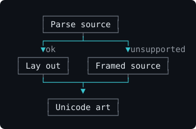

# grok-mermaid

Render Mermaid diagrams as Unicode box-drawing art, for terminals.

A TypeScript port of the terminal Mermaid renderer in
[xai-org/grok-build](https://github.com/xai-org/grok-build)
(`crates/codegen/xai-grok-markdown/src/mermaid.rs`). No browser, no headless
Chrome, no SVG — a self-contained layout engine that emits text.

```
      ┌──────────────┐
      │ Parse source │
      └───────┬──────┘
              │
              ▼
       ╭────────────╮
       │ Supported? │
       ╰──────┬─────╯
      ┌───────┴────────┐
      ▼yes             ▼no
 ┌─────────┐   ┌───────────────┐
 │ Lay out │   │ Framed source │
 └────┬────┘   └───────┬───────┘
      └───────┬────────┘
              ▼
       ┌─────────────┐
       │ Unicode art │
       └─────────────┘
```

## Install

```sh
npm install grok-mermaid
```

## Usage

```ts
import { render } from 'grok-mermaid'

const art = render('flowchart LR\n  A[Start] --> B[Done]', { maxWidth: 80 })
if (art) console.log(art.plain.join('\n'))
```

`render` returns `null` only for blank input. Everything else always produces
art: unsupported diagram types, and diagrams too wide for `maxWidth`, fall back
to the source in a framed box.

### Colour

The core is colour-blind. `styled` carries the same rows as `plain`, split into
runs tagged with a semantic class, so you map classes to your own theme:



That image is real `render()` output painted through one such theme — it is
generated by `bun run gen:demo`, not drawn by hand.

```ts
import { type Cls, render } from 'grok-mermaid'

const art = render(src, { maxWidth: process.stdout.columns })!

const theme: Partial<Record<Cls, (s: string) => string>> = {
  border: dim, text: white, edge: cyan, edgeLabel: gray,
}
const out = art.styled.map((row) =>
  row.map((span) => (theme[span.cls] ?? identity)(span.text)).join(''),
)
```

| Class | What it covers |
| --- | --- |
| `border` | box outlines, subgraph frames, compartment rules |
| `text` | node, participant and compartment labels |
| `edge` | connector lines and arrowheads |
| `edgeLabel` | text sitting on an edge |
| `title` | the `mermaid: <kind>` header of a fallback box |
| `hint` | the advisory note under a too-wide fallback box |
| `none` | blank filler |

`styled[i]` joined is always exactly `plain[i]`, so you can swap between them
freely.

Because layout carries no colour, a render can be cached across theme changes
and passed across a worker boundary — the output is plain JSON.

For the common case there is a helper:

```ts
import { render, toAnsi } from 'grok-mermaid'

console.log(toAnsi(render(src, { maxWidth: 100 })!).join('\n'))
```

`toAnsi(art, theme)` takes `Partial<Record<Cls, string>>` of SGR parameters
(`'2'` dim, `'36'` cyan, `'38;5;244'` for 256-colour), defaulting to a dim
frame with cyan connectors.

## Supported diagrams

| Type | Notes |
| --- | --- |
| `graph` / `flowchart` | `TD`/`TB`, `BT`, `LR`, `RL`; `subgraph` nesting; node shapes; solid/dotted/thick links; arrow, circle, cross heads; edge labels |
| `stateDiagram` / `stateDiagram-v2` | states, transitions, `[*]` start/end, `<<choice>>`, descriptions, composite states flattened |
| `classDiagram` | compartments, annotations, generics, cardinalities, inheritance/realization/composition/aggregation/dependency |
| `erDiagram` | entities, attributes, crow's-foot cardinalities |
| `sequenceDiagram` | participants, messages, self-messages, notes, `loop`/`alt`/`opt` dividers, `autonumber` |

## Credits

Inspired by Simon Willison's
[grok-mermaid.html](https://tools.simonwillison.net/grok-mermaid)
([source](https://github.com/simonw/tools/blob/main/grok-mermaid.html)), which
compiles the original Rust renderer to WebAssembly so it runs in a browser.
That demo is what made the renderer worth having outside the Grok CLI; this
port takes the other route and reimplements it in TypeScript, so it needs no
WASM and runs anywhere JS does.

## License

Apache-2.0. See [LICENSE](LICENSE) and [NOTICE](NOTICE).
