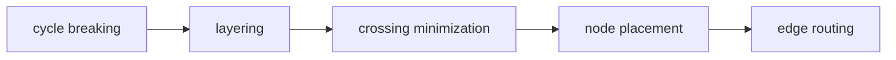
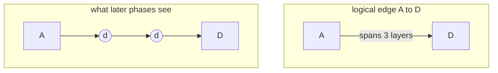
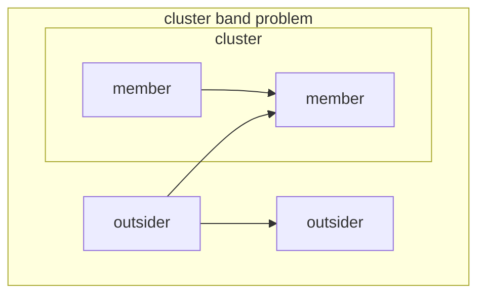

# Graph layout and routing — a field primer

How does a graph of nodes and edges become a picture? This is the graph
drawing field in one document, biased toward what matters for lovely-mermaid:
the **layered (Sugiyama) method**, **orthogonal edge routing**, and **compound
graphs**, i.e. what ELK does when we call it and what we would have to build
to replace it.

## 1. The problem

Input: a graph. Output: coordinates for every node and a route for every
edge. "Good" is defined by aesthetic criteria that are individually
optimizable but mutually contradictory:

- few edge crossings
- short edges, uniform edge lengths
- edges flow in one direction (for DAG-ish data)
- nodes spread evenly, no overlaps
- straight (or few-bend) edges
- symmetry where the graph has it
- small area

Almost every interesting subproblem is NP-hard (crossing minimization,
minimum feedback arc set, optimal 2-layer ordering…), so the whole field is
heuristics with occasional exact solvers for small pieces. The families:

| family | idea | good for | examples |
|---|---|---|---|
| **layered (Sugiyama)** | rank nodes into layers, order within layers, route between | DAGs, flows, hierarchies | dot, dagre, ELK layered |
| force-directed | springs + repulsion, iterate to equilibrium | undirected, "hairballs" | fdp, d3-force |
| stress / MDS | place so geometric distance ≈ graph distance | large undirected | neato, sfdp |
| tree | recursive tidy placement of subtrees | actual trees | Reingold–Tilford, ELK mrtree |
| radial | tree/layers on concentric circles | hierarchies with a center | ELK radial |
| orthogonal/planar | topology-shape-metrics: planarize, then bend-minimize | circuit-like, UML | OGDF, yFiles orthogonal |
| packing | place disconnected components / rectangles | dashboards, treemaps | ELK rectpacking, disco |

Mermaid-style diagrams (flowchart, state, class, ER) are directed and mostly
acyclic, so the layered method is the right tool, and it is what both
mermaid's default engine (dagre) and ELK use.

## 2. The layered (Sugiyama) pipeline

The 1981 Sugiyama–Tagawa–Toda framework decomposes the intractable problem
into five sequential phases, each locally heuristic:



Every phase consumes the previous phase's commitment and cannot revisit it.
That is both why it is fast and why layered layouts sometimes look "locally
dumb": the information needed to fix a bad decision existed only two phases
later.

### 2.1 Cycle breaking

Layering requires a DAG, so a set of edges is chosen and **reversed** (not
removed — they are drawn in original direction at the end, they just point
"up" through the layers). The clean formulation is minimum feedback arc set
(NP-hard); practice uses:

- **GREEDY** (Eades–Lin–Smyth): repeatedly peel sources and sinks, break
  ties by out-degree − in-degree. Minimizes reversed edges well, ignores
  everything else. ELK's default.
- **DEPTH_FIRST**: DFS from the roots; edges that close a cycle (back edges)
  get reversed. Reverses more edges than greedy in theory, but reversals
  follow the source's narrative order, so diagrams "read" causally. What we
  use — on the arch diagram it turned wrap-around bundles into short
  feedback edges.
- **MODEL_ORDER / GREEDY_MODEL_ORDER**: prefer reversing edges that go
  "backward" in source order. Conceptually the best match for hand-written
  diagrams. elkjs ≥ 0.11 regression: crashes when the strategy is set on a
  compound node that contains a cycle (`examples/cluster-cycle.mmd`);
  setting it on the root only avoids it and is equivalent under
  INCLUDE_CHILDREN.

A reversed edge later gets its arrowheads swapped at draw time, or is routed
as a **feedback edge** — a route deliberately outside the normal channels,
hugging the flow's side.

### 2.2 Layering (ranking)

Assign every node a layer index such that every edge points to a strictly
higher layer. The quality knobs: total edge span (an edge crossing k layers
costs k), number of layers (height), max nodes per layer (width).

- **LONGEST_PATH**: rank = longest path from a source. Linear time, minimal
  layer count, but piles everything else into the first layers — wide and
  lopsided.
- **NETWORK_SIMPLEX** (Gansner et al., the dot paper): minimize total
  weighted edge span exactly, via a spanning-tree simplex on an LP whose
  variables are the ranks. Near-linear in practice, the standard default.
- **COFFMAN_GRAHAM**: classic scheduling algorithm; bounds nodes per layer.
- **MIN_WIDTH**: heuristically minimize the widest layer.

The trap we measured: width-bounding strategies count *real* nodes, but the
drawn width of a layer is dominated by **dummy nodes** — every edge spanning
more than one layer is split into a chain of invisible one-layer edges with
a dummy node in each crossed layer:



Dummies exist so the next two phases can treat *every* edge as connecting
adjacent layers. Long edges therefore occupy horizontal room in every layer
they cross, which is why `MIN_WIDTH` made our diagrams wider, not narrower.
Node placement, not layering, turned out to be the real width lever.

### 2.3 Crossing minimization

Choose an order of nodes (real + dummy) inside each layer. Crossings between
adjacent layers depend only on the two orders, so the standard approach is a
**layer sweep**: fix layer i, reorder layer i+1 to minimize crossings against
it, proceed down; then sweep back up; repeat until it stops improving. Even
the one-sided two-layer subproblem is NP-hard, so the reorder step is a
heuristic:

- **barycenter**: place each node at the average position of its neighbors
  in the fixed layer. Fast, good, the default everywhere.
- **median**: same with median; slightly better worst-case guarantees.

Sweeps are run from several random starting orders and the best result kept
(ELK's `thoroughness` controls how many). Two subtleties:

- **In-layer edges** (between nodes of the same layer — from cycles or
  constraints) and **north/south ports** add ordering constraints.
- The order of dummy nodes decides how parallel long edges braid — most
  "spaghetti" in a bad layered drawing is dummy ordering, not node ordering.

This phase fixes the diagram's *topology*: after it, what crosses what is
decided; everything later is geometry.

### 2.4 Node placement (coordinate assignment)

Turn per-layer orders into actual coordinates on the cross axis (x in a
top-down layout). Constraint: keep the computed order, keep minimum gaps.
Objective: straighten edges — especially the dummy chains, so long edges
draw as straight lines rather than staircases.

- **BRANDES_KOEPF**: the literature standard, and ELK's default. Computes
  four extreme alignments (lean left/right × look up/down), each in linear
  time by greedily aligning nodes into vertical blocks, then takes the
  per-node median of the four. Produces balanced, symmetric-looking
  drawings; the price is width — balancing pads gaps.
- **LINEAR_SEGMENTS**: identify maximal chains (a node plus its dummy run)
  that want to be a straight vertical segment, then place segments with a
  pendulum-style balancing pass. Systematically narrower than B-K (~15% on
  our arch diagram), slightly less symmetric.
- **NETWORK_SIMPLEX**: the dot approach again — an LP minimizing weighted
  horizontal displacement along edges. Straightest edges, most expensive.
- **SIMPLE**: stack nodes with minimum gaps. Narrowest and ugliest.

A post-**compaction** pass (ELK: `postCompaction`) can then shove placed
nodes toward one side or along their edges to reclaim slack that balancing
left behind — that pass is what made LINEAR_SEGMENTS strictly better than
the default for us (same height, −15% width).

### 2.5 Edge routing

Draw the edges through the placed nodes. Three styles:

- **polyline**: straight segments through the dummy positions, bends
  wherever direction changes.
- **splines**: fit Béziers through/around; what dot does.
- **orthogonal**: axis-parallel segments only — the one a character grid
  can draw, and the reason ELK maps 1:1 to terminal art.

Orthogonal routing between two layers is **channel routing**, borrowed from
VLSI: the gap between consecutive layers is a channel; each edge becomes
(vertical stub) – (horizontal jog) – (vertical stub); horizontal jogs that
overlap vertically must occupy different **tracks** (rows) of the channel.
Assigning jogs to tracks is interval-graph coloring — sort by endpoints,
greedily pack compatible jogs into the same track:

```
layer i:      [A]      [B]      [C]
               │        │        │
  track 1      └────────┼──┐     │      ← A→E and B→D share no x-range…
  track 2           ┌───┘  │     │      ← …but B→D needs its own track
               ┌────┼──────┼─────┘
layer i+1     [D]  [E]    [F]
```

ELK additionally merges edges that share a source or target into
**hyperedges** (one trunk, several branches) when `mergeEdges` is on, and
handles **conflicts** (a vertical stub crossing a foreign horizontal jog)
by inserting extra bends. The channel heights are exactly the
`spacing.edgeEdgeBetweenLayers`/`edgeNodeBetweenLayers` gaps we tuned: each
occupied track adds one unit between the layers.

Self-loops never enter the pipeline — they are laid out around their node
at the end. Edge labels, if given to the engine, become label dummy nodes
that reserve space mid-route (we deliberately withhold them and place
labels post-hoc instead — reserving corridor space is what inflated the
diagrams).

## 3. Compound (hierarchical) graphs

Subgraphs-as-boxes (mermaid `subgraph`, state composites) change everything,
because a cluster imposes a *geometric* constraint — its members must end in
one contiguous rectangle — on phases that reason *combinatorially*.

Two strategies:

**Recursive (dagre, mermaid classic):** lay out each cluster in isolation,
collapse it to a single big node, lay out the parent. Simple, composable —
but an edge crossing a cluster boundary can only be routed to the collapsed
box, not to the inner node. This is visibly wrong in mermaid's dagre output:
cross-boundary edges stop at the cluster border.

**Global with constraints (ELK `INCLUDE_CHILDREN`):** one pipeline over the
flattened graph, with every phase cluster-aware:

- layering must give each cluster a contiguous band of layers;
- crossing minimization must keep members adjacent in every layer (mixing
  members of sibling clusters in one layer order would make the rectangles
  overlap);
- placement adds the border rectangles (as border dummy nodes) and padding;
- routing pierces borders at crossing points, producing one route section
  per crossed hierarchy level (why our `drawEdge` chains sections).

This is the feature we chose ELK for — cross-boundary edges reach the
actual inner nodes — and the source of its hardest artifacts: a cluster's
layer band must be as tall as *everything* routed through or beside it, so
heavy cross-hierarchy bundles inflate clusters with empty interior space.
It is also why per-cluster `direction` is ignored: one global pipeline has
one direction.



## 4. Ports and other constraints

Real ELK is a **port-based** framework (it comes from dataflow/circuit
tools): edges attach to ports, and `portConstraints` ranges from FREE
through FIXED_SIDE/FIXED_ORDER to FIXED_POS. Ports thread through every
phase (they constrain crossing minimization and routing). We currently use
no ports — ELK invents free ones — which is why edges enter nodes wherever
the layering says; declaring south/east ports would be the lever for
"enter from the side/bottom", at the cost of maintaining port bookkeeping.

Other constraint machinery in layered engines: layer constraints (pin to
first/last layer), in-layer successor constraints, alignment groups,
`considerModelOrder` (bias every tie-break toward source order — this is
dagre/mermaid's implicit behavior and why mermaid output tends to follow
the order you typed).

## 5. How ELK actually organizes it

ELK layered is the five phases plus ~60 optional **intermediate processors**
slotted between them (border expansion, port ordering, label dummies,
self-loop placement, in-layer edge splitting, feedback route post-processing,
…). Options select processors; that is why option interactions are hard to
predict from documentation and why we A/B empirically. elkjs is the actual
Java implementation transpiled with GWT — bit-identical behavior, unreadable
stack traces, bugs unfixable downstream (the model-order-on-hierarchy crash).

The practical option map for us:

| lever | option | our setting |
|---|---|---|
| direction of "down" | `elk.direction` | graph header |
| reversal choice | `layered.cycleBreaking.strategy` | DEPTH_FIRST |
| rank assignment | `layered.layering.strategy` | NETWORK_SIMPLEX (default) |
| in-layer order | `layered.crossingMinimization.*` | defaults |
| width vs symmetry | `layered.nodePlacement.strategy` | B-K, LINEAR_SEGMENTS candidate |
| reclaim slack | `layered.compaction.postCompaction.strategy` | candidate |
| channel gaps | `spacing.*` / `layered.spacing.*BetweenLayers` | 1–6 cells |
| clusters | `hierarchyHandling: INCLUDE_CHILDREN` | root |
| bundle trunks | `layered.mergeEdges` | off |

## 6. What the terminal grid changes

Our renderer consumes ELK float coordinates and draws on a character grid;
the differences from an SVG target are all in `layout-elk.ts`:

- **Integer snapping.** Everything rounds to cells; a 0.5 disagreement
  between two points of one edge becomes a visible one-cell jog, so chains
  are re-orthogonalized after rounding (each point inherits the previous
  point's minor axis).
- **Cell aspect.** A character cell is ~1:2 (w:h), so "equal" visual
  spacing means row gaps of half the column gaps — our spacing table, not
  ELK's uniform defaults.
- **Half-open node sides.** ELK ends a route on the node's geometric edge;
  bottom/right coordinates are one past the border *cell*, top/left ones
  are the border cell. Arrowhead placement corrects per approach direction.
- **Line merging, not line avoidance.** Crossing strokes are legal — the
  canvas merges direction bits into junction glyphs (`┼`, `┳`…), and
  borders are pierced by resolving bits, where SVG routing must dodge.
- **Labels post-hoc.** ELK never sees edge labels; after routing, each
  label slides into a horizontal run of its own edge, straddles a vertical
  run, or (last resort) sits beside it ellipsised. Giving ELK the labels
  reserved corridor space and inflated everything.
- **Grid as occupancy map.** The canvas doubles as a collision structure:
  free label space, pierceable border cells, and text cells are all queries
  on the drawn grid — no separate spatial index.

## 7. The rest of the field, briefly

- **dot / Graphviz** (Gansner–Koutsofios–North–Vo 1993): the canonical
  layered implementation — network simplex for both layering and x-coords,
  spline routing. The paper ("A Technique for Drawing Directed Graphs") is
  still the best single read on the pipeline.
- **dagre**: JS reimplementation of the dot pipeline; mermaid's default.
  Recursive cluster handling, polyline routes.
- **libavoid / draw.io style routing**: no global layout at all — nodes are
  user-placed, each edge independently finds an orthogonal route around
  obstacles (A*/visibility graph over a spatial index), then a nudging pass
  separates parallel runs. This is the alternative worldview: layout and
  routing fully decoupled. Our earlier rule-based router was a step in this
  direction (corridors + piercing), and a post-ELK "shortcut pass" for
  silly wrap-arounds would be exactly one A* query per offending edge.
- **Topology-shape-metrics** (orthogonal drawing proper): planarize (insert
  crossing dummies), bend-minimize via min-cost flow (Tamassia), then
  compact. Beautiful for degree-≤4 graphs (circuits), rarely used for
  flowcharts because node sizes and high degree break its assumptions.
- **Force/stress methods**: irrelevant for directed flow (no direction
  concept), but ELK's `stress`/`force` exist for the undirected cases.
- **yFiles**: the commercial state of the art; its hierarchic layout is the
  benchmark ELK chases. Closed source, but its docs are a readable catalog
  of what a production layered engine must handle.

## 8. Reading list

- Gansner, Koutsofios, North, Vo — *A Technique for Drawing Directed
  Graphs* (1993). The dot paper; network simplex layering and placement.
- Sugiyama, Tagawa, Toda — *Methods for Visual Understanding of
  Hierarchical System Structures* (1981). The original framework.
- Brandes, Köpf — *Fast and Simple Horizontal Coordinate Assignment*
  (2001). The placement default in ELK and dagre.
- Eades, Lin, Smyth — *A Fast and Effective Heuristic for the Feedback Arc
  Set Problem* (1993). GREEDY cycle breaking.
- Sander — *Layout of Compound Directed Graphs* (1996). The global
  cluster-aware pipeline ELK's INCLUDE_CHILDREN descends from.
- Schulze, Spönemann, von Hanxleden — *Drawing Layered Graphs with Port
  Constraints* (2014). ELK layered itself.
- Wybrow, Marriott, Stuckey — *Orthogonal Connector Routing* (2009).
  libavoid; the layout-free routing worldview.
- ELK reference: <https://eclipse.dev/elk/reference.html> — every option,
  with the algorithm it belongs to.
