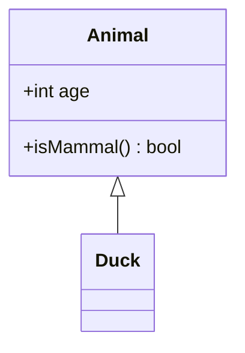
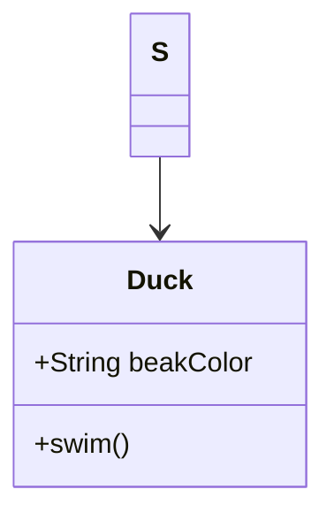
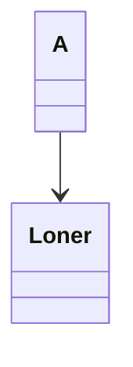

A class renders title, attribute and method compartments.



```text
┌──────────────────┐
│      Animal      │
├──────────────────┤
│ +int age         │
├──────────────────┤
│ +isMammal() bool │
└──────────────────┘
          △
          │
      ┌──────┐
      │ Duck │
      └──────┘
```

Colon members merge with a class block.



```text
         ┌───┐
         │ S │
         └─┬─┘
           │
           ▼
 ┌───────────────────┐
 │       Duck        │
 ├───────────────────┤
 │ +String beakColor │
 ├───────────────────┤
 │ +swim()           │
 └───────────────────┘
```

An empty class is a plain titled box.



```text
   ┌───┐
   │ A │
   └─┬─┘
     │
     ▼
 ┌───────┐
 │ Loner │
 └───────┘
```

An annotation renders guillemets; generics display as angle brackets.

```mermaid
classDiagram
  <<interface>> Shape
  Shape~T~ : +area() T
  Shape~T~ <|.. Circle
```

```text
 ┌─────────────┐   ┌───────────┐
 │ «interface» │   │ Shape<T>  │
 │    Shape    │   ├───────────┤
 └─────────────┘   │ +area() T │
                   └───────────┘
                         △
                         ╎
                    ┌────────┐
                    │ Circle │
                    └────────┘
```
