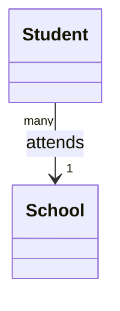

Cardinalities sit at their own edge ends, the verb between them.


```mermaid
classDiagram
  Student "many" --> "1" School : attends
```

```text
 ┌─────────┐
 │ Student │
 └────┬────┘
      │many
      │attends
      ▼1
 ┌────────┐
 │ School │
 └────────┘
```
