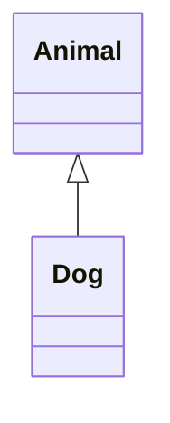

A `:::class` tag is swallowed, not rendered.


```mermaid
classDiagram
  class Animal:::hot
  Animal <|-- Dog
```

```text
┌────────┐
│ Animal │
└────────┘
     △
     │
  ┌─────┐
  │ Dog │
  └─────┘
```
