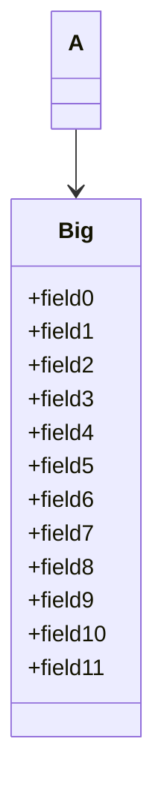

Members elide past the cap with an ellipsis row.



```text
    ┌───┐
    │ A │
    └─┬─┘
      │
      ▼
 ┌─────────┐
 │   Big   │
 ├─────────┤
 │ +field0 │
 │ +field1 │
 │ +field2 │
 │ +field3 │
 │ +field4 │
 │ +field5 │
 │ +field6 │
 │ +field7 │
 │ …       │
 └─────────┘
```
