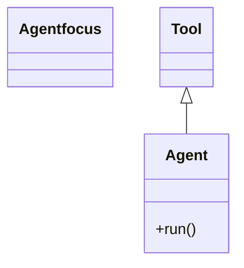
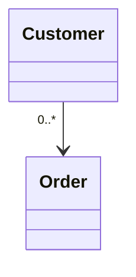
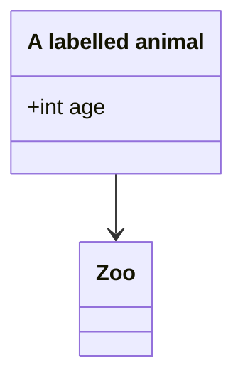
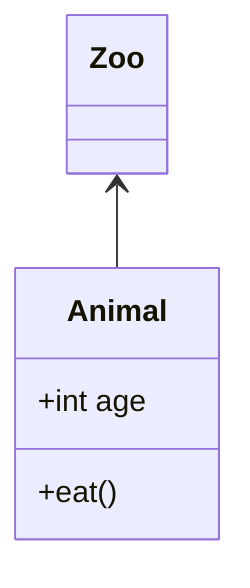

# Class-diagram regressions

`class Agent focus` is the assignment form (a class name carries no spaces),
not a malformed declaration — no warning, and the spans carry the class
(pinned in parse.test.ts).



```text
 ┌──────┐
 │ Tool │
 └──────┘
     △
     │
┌────────┐
│ Agent  │
├────────┤
│ +run() │
└────────┘
```

A quoted cardinality containing `..` on the left side never reads as a
dotted-link operator.



```text
┌──────────┐
│ Customer │
└─────┬────┘
      │0..*
      │
      ▼
  ┌───────┐
  │ Order │
  └───────┘
```

`class A["Label"]` (mermaid ≥10.1) titles the box with the label; the id
keys relations. Previously the spaced form silently nulled the diagram and
the compact form forked into two nodes.



```text
 ┌───────────────────┐
 │ A labelled animal │
 ├───────────────────┤
 │ +int age          │
 └─────────┬─────────┘
           │
           ▼
        ┌─────┐
        │ Zoo │
        └─────┘
```

`direction BT` keeps compartments in order: title on top, attributes above
methods, separators between.



```text
   ┌─────┐
   │ Zoo │
   └─────┘
      ▲
      │
┌─────┴────┐
│  Animal  │
├──────────┤
│ +int age │
├──────────┤
│ +eat()   │
└──────────┘
```
