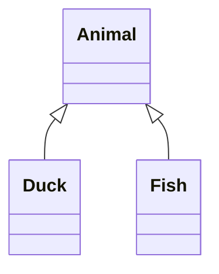
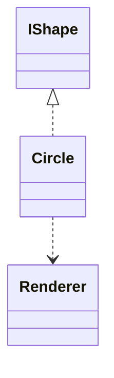
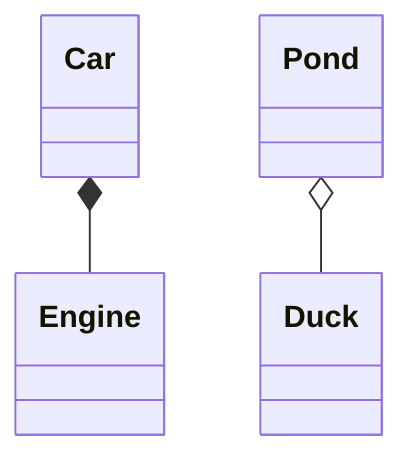
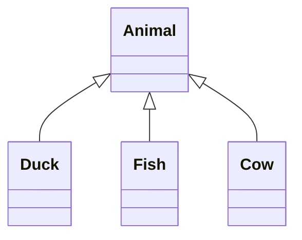

Inheritance puts the triangle at the parent.



```text
     ┌────────┐
     │ Animal │
     └────────┘
          △
    ┌─────┴────┐
    │          │
┌──────┐   ┌──────┐
│ Duck │   │ Fish │
└──────┘   └──────┘
```

Realization is dotted; dependency is a dotted arrow.



```text
 ┌────────┐
 │ IShape │
 └────────┘
      △
      ╎
 ┌────────┐
 │ Circle │
 └────┬───┘
      ╎
      ▼
┌──────────┐
│ Renderer │
└──────────┘
```

Composition and aggregation render filled and hollow diamonds.



```text
  ┌─────┐    ┌──────┐
  │ Car │    │ Pond │
  └─────┘    └──────┘
     ◆           ◇
     │           │
┌────────┐   ┌──────┐
│ Engine │   │ Duck │
└────────┘   └──────┘
```

A from-end head survives a fan-out jog: one triangle for three children.



```text
          ┌────────┐
          │ Animal │
          └────────┘
               △
    ┌──────────┼──────────┐
    │          │          │
┌──────┐   ┌──────┐    ┌─────┐
│ Duck │   │ Fish │    │ Cow │
└──────┘   └──────┘    └─────┘
```
