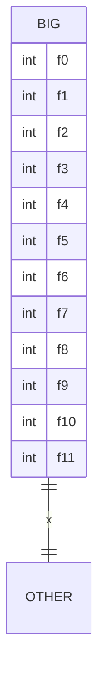

Attributes elide past the cap with an ellipsis row.



```text
┌────────┐
│  BIG   │
├────────┤
│ int f0 │
│ int f1 │
│ int f2 │
│ int f3 │
│ int f4 │
│ int f5 │
│ int f6 │
│ int f7 │
│ …      │
└────┬───┘
     │1
     │x
     │1
 ┌───────┐
 │ OTHER │
 └───────┘
```
