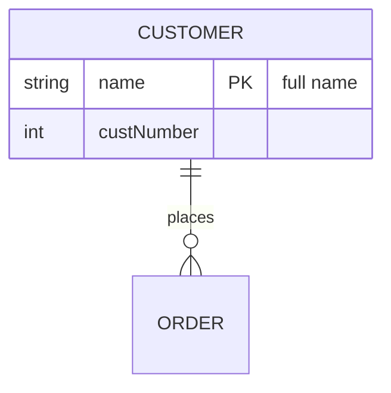
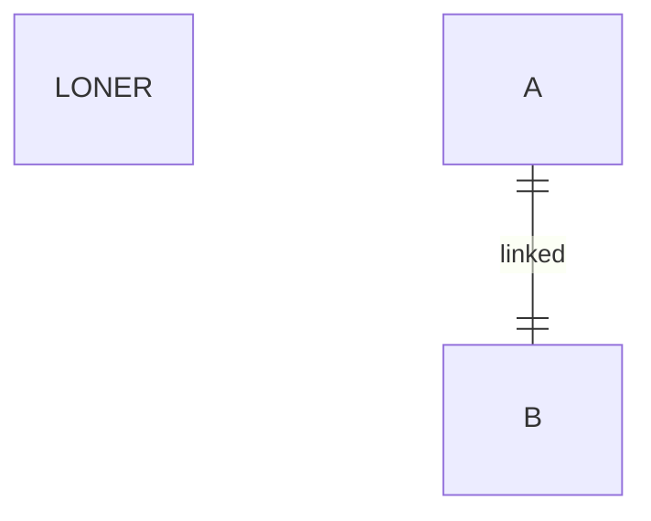

Entities with attributes; cardinalities at their own ends, the verb
between them; attribute comments are hidden; `0..*` shortens to `*`.



```text
┌────────────────┐
│    CUSTOMER    │
├────────────────┤
│ string name PK │
│ int custNumber │
└────────┬───────┘
         │1
         │places
         │*
     ┌───────┐
     │ ORDER │
     └───────┘
```

A bare entity declaration renders.



```text
 ┌───────┐   ┌───┐
 │ LONER │   │ A │
 └───────┘   └─┬─┘
               │1
               │linked
               │1
             ┌───┐
             │ B │
             └───┘
```
