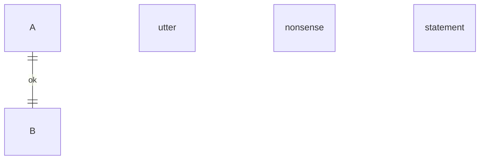

An unknown statement is dropped with a warning, not fatal.



```text
 ┌───┐
 │ A │
 └─┬─┘
   │1
   │ok
   │1
 ┌───┐
 │ B │
 └───┘
```

```warnings
dropped, unreadable statement: "utter nonsense statement"
```
