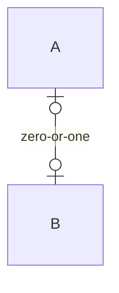
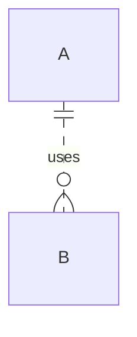

The cardinality operators map to end labels; ER relationships never draw
arrowheads.



```text
 ┌───┐
 │ A │
 └─┬─┘
   │0..1
   │zero-or-one
   │0..1
 ┌───┐
 │ B │
 └───┘
```

```mermaid
erDiagram
  A }o--o{ B : many
```

```text
 ┌───┐
 │ A │
 └─┬─┘
   │*
   │many
   │*
 ┌───┐
 │ B │
 └───┘
```

```mermaid
erDiagram
  A }|--|{ B : one-or-more
```

```text
 ┌───┐
 │ A │
 └─┬─┘
   │1..*
   │one-or-more
   │1..*
 ┌───┐
 │ B │
 └───┘
```

A non-identifying relationship renders dotted.



```text
 ┌───┐
 │ A │
 └─┬─┘
   ╎1
   ╎uses
   ╎*
 ┌───┐
 │ B │
 └───┘
```

An operator that is not a relationship refuses.

```mermaid
erDiagram
  A ||==o{ B : x
```

(null)

```mermaid
erDiagram
  A garbage B : x
```

(null)
