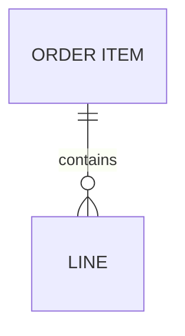

A quoted entity name is its own identity and the quotes are not part of the
title; a streamed unclosed alias warns like flowchart's brackets do.



```text
┌────────────┐
│ ORDER ITEM │
└──────┬─────┘
       │1
       │contains
       │*
   ┌──────┐
   │ LINE │
   └──────┘
```
