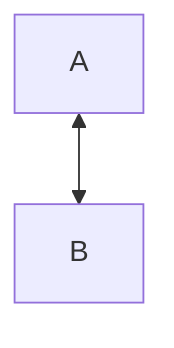
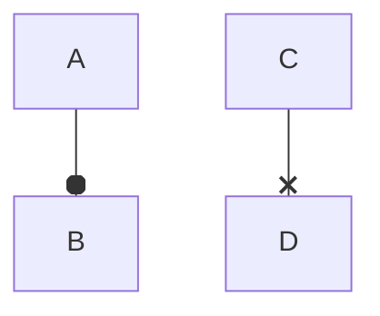
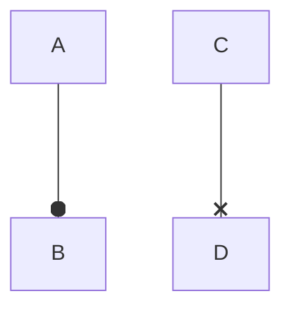
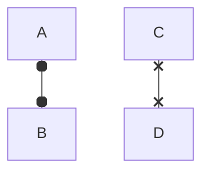

A bidirectional link draws both arrowheads.


```text
┌───┐    ┌───┐
│ A ◄───▶│ B │
└───┘    └───┘
```



```text
 ┌───┐
 │ A │
 └─▲─┘
   │
   ▼
 ┌───┐
 │ B │
 └───┘
```

A reversed arrow ranks the source above the target.

```mermaid
graph TD
  A <-- B
```

```text
 ┌───┐
 │ B │
 └─┬─┘
   │
   ▼
 ┌───┐
 │ A │
 └───┘
```

Circle and cross endings decorate the target end; the letters do not
become phantom nodes.



```text
 ┌───┐   ┌───┐
 │ A │   │ C │
 └─┬─┘   └─┬─┘
   │       │
   o       ×
 ┌───┐   ┌───┐
 │ B │   │ D │
 └───┘   └───┘
```

Left-end markers decorate without reversing; a reversed arrow with a marker
swaps direction; both ends may carry markers.

```mermaid
graph TD
  A o-- B
  C x-- D
```

```text
 ┌───┐   ┌───┐
 │ A │   │ C │
 └─o─┘   └─×─┘
   │       │
   │       │
 ┌───┐   ┌───┐
 │ B │   │ D │
 └───┘   └───┘
```



```text
 ┌───┐   ┌───┐
 │ B │   │ D │
 └─o─┘   └─×─┘
   │       │
   ▼       ▼
 ┌───┐   ┌───┐
 │ A │   │ C │
 └───┘   └───┘
```



```text
 ┌───┐   ┌───┐
 │ A │   │ C │
 └─o─┘   └─×─┘
   │       │
   o       ×
 ┌───┐   ┌───┐
 │ B │   │ D │
 └───┘   └───┘
```
