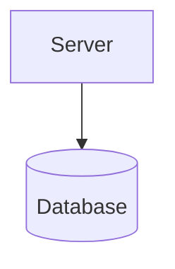
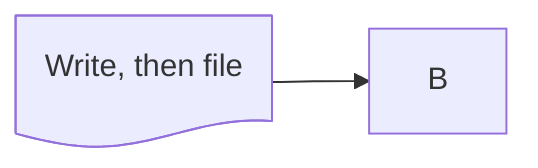

The v2 `@{}` node syntax parses shape and label; `cyl` maps to the
rounded silhouette.



```text
 ┌────────┐
 │ Server │
 └────┬───┘
      │
      ▼
╭──────────╮
│ Database │
╰──────────╯
```

Quoted values keep their commas; an unknown shape draws as a plain box.



```text
┌──────────────────┐    ┌───┐
│ Write, then file ├───▶│ B │
└──────────────────┘    └───┘
```

An unclosed `@{` is reported, not swallowed.

```mermaid
flowchart TD
  X@{shape: cyl, label: "unclosed
```

```text
 ╭───────────╮
 │ "unclosed │
 ╰───────────╯
```

```warnings
node "X": label is missing its closing `}`
```
