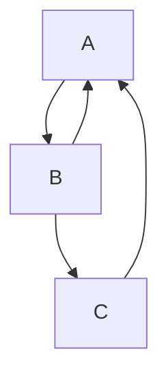
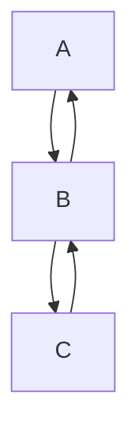

Back edges to one target share a lane.



```text
 ┌───┐
 │ A │◄┐
 └─┬─┘ │
   │   │
   ▼   │
 ┌───┐ │
 │ B ├─┤
 └─┬─┘ │
   │   │
   ▼   │
 ┌───┐ │
 │ C ├─┘
 └───┘
```

Back edges to different targets claim separate lanes.



```text
 ┌───┐
 │ A │◄┐
 └─┬─┘ │
   │   │
   ▼   │
 ┌───┐ │
 │ B ├◄┴┐
 └─┬─┘  │
   │    │
   ▼    │
 ┌───┐  │
 │ C ├──┘
 └───┘
```
