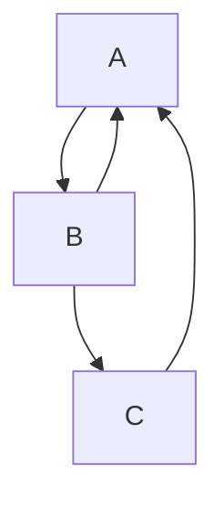
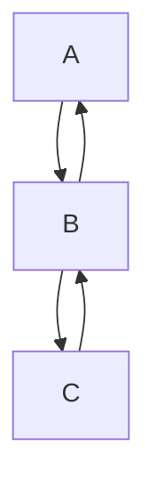
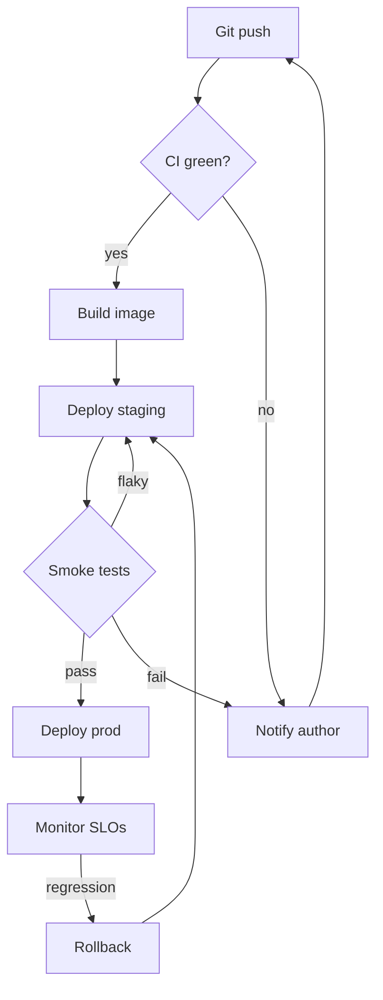
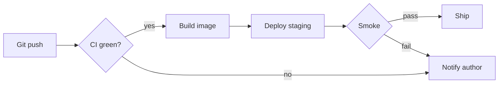
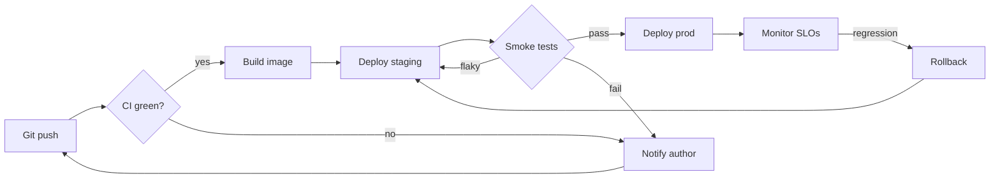

A back edge between adjacent ranks returns locally beside the forward
edge; one skipping ranks goes around through the side lane.



```text
 ┌───┐
 │ A │◄┐
 └─┬─┘ │
   │▲  │
   ▼│  │
 ┌──┴┐ │
 │ B │ │
 └─┬─┘ │
   │   │
   ▼   │
 ┌───┐ │
 │ C ├─┘
 └───┘
```

Adjacent-rank back edges return locally at every step of a chain.



```text
 ┌───┐
 │ A │
 └─┬─┘
   │▲
   ▼│
 ┌──┴┐
 │ B │
 └─┬─┘
   │▲
   ▼│
 ┌──┴┐
 │ C │
 └───┘
```

All three regimes in one realistic pipeline: a local `flaky` return, two
multi-rank lanes (`roll`/`notify` back to earlier ranks) and a `no` skip
edge — no crossings between the local return and its forward sibling.



```text
            ┌──────────┐
┌──────────▶│ Git push │
│           └─────┬────┘
│                 │
│                 ▼
│           ╔═══════════╗
│           ║ CI green? ║
│           ╚═════╤═════╝
│┌────────────────┴────┐
││                     ▼yes
││              ┌─────────────┐
││              │ Build image │
││              └──────┬──────┘
││                     │
││                     ▼
││            ┌────────────────┐
││            │ Deploy staging │◄─────────────┐
││            └────────┬───────┘              │
││                     │ ▲flaky               │
││                     ▼ │                    │
││              ╔════════╧════╗               │
││              ║ Smoke tests ║               │
││              ╚══════╤══════╝               │
││         ┌───────────┴─────────┐            │
│└─────────┼─────┐               │            │
│          ▼fail ▼no             ▼pass        │
│     ┌───────────────┐   ┌─────────────┐     │
└─────┤ Notify author │   │ Deploy prod │     │
      └───────────────┘   └──────┬──────┘     │
                                 │            │
                                 ▼            │
                         ┌──────────────┐     │
                         │ Monitor SLOs │     │
                         └───────┬──────┘     │
                                 │            │
                                 ▼regression  │
                           ┌──────────┐       │
                           │ Rollback ├───────┘
                           └──────────┘
```

An LR skip whose target row is clear of intermediate boxes runs straight
through, splitting off the source's right-side fan (`┤` up/down) and
merging into the target's arrival; a same-row skip keeps the bottom lane.



```text
                                                                                      pass  ┌──────┐
                                                                                     ┌─────▶│ Ship │
                              yes  ┌─────────────┐    ┌────────────────┐    ╔═══════╗│      └──────┘
┌──────────┐    ╔═══════════╗┌────▶│ Build image ├───▶│ Deploy staging ├───▶║ Smoke ╟┤
│ Git push ├───▶║ CI green? ╟┤no   └─────────────┘    └────────────────┘    ╚═══════╝│fail  ┌───────────────┐
└──────────┘    ╚═══════════╝└───────────────────────────────────────────────────────┴─────▶│ Notify author │
                                                                                            └───────────────┘
```

The full pipeline sideways: labelled lanes refuse to share a row (the
label would claim every merged edge), so `flaky` and the rollback return
ride separate rows and join only on the final ascent into their shared
target; lane labels interrupt their own line.



```text
                                                                                            pass  ┌─────────────┐      ┌──────────────┐ regression  ┌──────────┐
                                                                                           ┌─────▶│ Deploy prod ├─────▶│ Monitor SLOs ├────────────▶│ Rollback │
                              yes  ┌─────────────┐    ┌────────────────┐    ╔═════════════╗│      └─────────────┘      └──────────────┘             └─────┬────┘
┌──────────┐    ╔═══════════╗┌────▶│ Build image ├───▶│ Deploy staging ├───▶║ Smoke tests ╟┤                                                              │
│ Git push ├───▶║ CI green? ╟┘     └─────────────┘    └────────────────┘    ╚══════╤══════╝│fail  ┌───────────────┐                                       │
└──────────┘    ╚═════╤═════╝                                  ▲                   │       └─────▶│ Notify author │                                       │
      ▲               │                                        │                   │              └───────┬───────┘                                       │
      │               │                                        │                   │                      ▲                                               │
      │               │                                        ├────── flaky ──────┘                      │                                               │
      │               └────────────────────────────────────────┼ no ──────────────────────────────────────┤                                               │
      │                                                        └──────────────────────────────────────────┼───────────────────────────────────────────────┘
      └───────────────────────────────────────────────────────────────────────────────────────────────────┘
```
