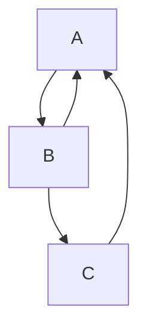
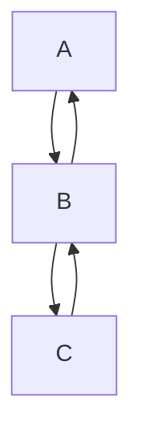

A back edge between adjacent ranks returns locally beside the forward
edge; one skipping ranks goes around through the side lane.



```text
 ┌───┐
 │ A │◄┐
 └─┬─┘ │
   │▲  │
   ▼│  │
 ┌──┴┐ │
 │ B │ │
 └─┬─┘ │
   │   │
   ▼   │
 ┌───┐ │
 │ C ├─┘
 └───┘
```

Adjacent-rank back edges return locally at every step of a chain.



```text
 ┌───┐
 │ A │
 └─┬─┘
   │▲
   ▼│
 ┌──┴┐
 │ B │
 └─┬─┘
   │▲
   ▼│
 ┌──┴┐
 │ C │
 └───┘
```
