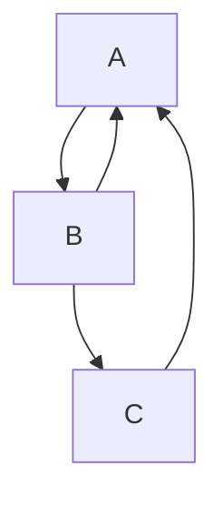
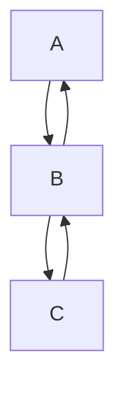
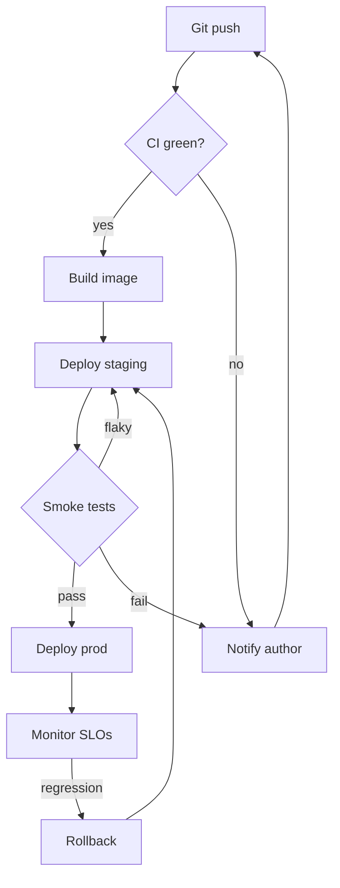

A back edge between adjacent ranks returns locally beside the forward
edge; one skipping ranks goes around through the side lane.



```text
 ┌───┐
 │ A │◄┐
 └─┬─┘ │
   │▲  │
   ▼│  │
 ┌──┴┐ │
 │ B │ │
 └─┬─┘ │
   │   │
   ▼   │
 ┌───┐ │
 │ C ├─┘
 └───┘
```

Adjacent-rank back edges return locally at every step of a chain.



```text
 ┌───┐
 │ A │
 └─┬─┘
   │▲
   ▼│
 ┌──┴┐
 │ B │
 └─┬─┘
   │▲
   ▼│
 ┌──┴┐
 │ C │
 └───┘
```

All three regimes in one realistic pipeline: a local `flaky` return, two
multi-rank lanes (`roll`/`notify` back to earlier ranks) and a `no` skip
edge — no crossings between the local return and its forward sibling.



```text
                ┌──────────┐
                │ Git push │◄────────────┐
                └─────┬────┘             │
                      │                  │
                      ▼                  │
                ╔═══════════╗            │
                ║ CI green? ║            │
                ╚═════╤═════╝            │
                  ┌───┴───────────┐      │
                  ▼yes            │      │
           ┌─────────────┐        │      │
           │ Build image │        │      │
           └──────┬──────┘        │      │
                  │               │      │
                  ▼               │      │
         ┌────────────────┐       │      │
         │ Deploy staging │◄──────┼─────┐│
         └────────┬───────┘       │     ││
                  │ ▲flaky        │     ││
                  ▼ │             │     ││
           ╔════════╧════╗        │     ││
           ║ Smoke tests ║        │     ││
           ╚══════╤══════╝        │     ││
        ┌─────────┴────────┐      │     ││
        ▼pass              ▼fail  ▼no   ││
 ┌─────────────┐   ┌───────────────┐    ││
 │ Deploy prod │   │ Notify author ├────┼┘
 └──────┬──────┘   └───────────────┘    │
        │                               │
        ▼                               │
┌──────────────┐                        │
│ Monitor SLOs │                        │
└───────┬──────┘                        │
        │                               │
        ▼regression                     │
  ┌──────────┐                          │
  │ Rollback ├──────────────────────────┘
  └──────────┘
```
