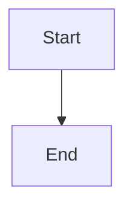
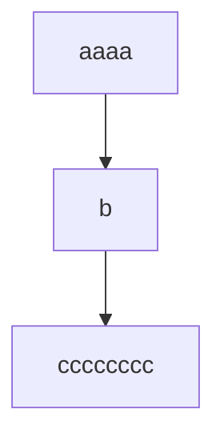
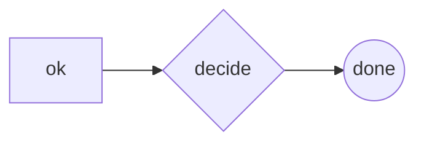

A minimal TD flowchart: boxes, labels, one arrow.



```text
 ┌───────┐
 │ Start │
 └───┬───┘
     │
     ▼
  ┌─────┐
  │ End │
  └─────┘
```

A chain stays a straight vertical spine — no corner glyphs.



```text
  ┌──────┐
  │ aaaa │
  └───┬──┘
      │
      ▼
    ┌───┐
    │ b │
    └─┬─┘
      │
      ▼
┌──────────┐
│ cccccccc │
└──────────┘
```

Node shapes: rectangle, diamond, circle.



```text
┌────┐    ╔════════╗    ╭──────╮
│ ok ├───▶║ decide ╟───▶│ done │
└────┘    ╚════════╝    ╰──────╯
```
