An unterminated label is reported, not swallowed — without the warning
this reads as one node called `Start --> B` and the edge is silently gone.

```mermaid
graph TD
  A[Start --> B
```

```text
 ┌─────────────┐
 │ Start --> B │
 └─────────────┘
```

```warnings
node "A": label is missing its closing `]`
```

```mermaid
graph TD
  A["Start] --> B
```

```text
 ┌───────────────┐
 │ "Start] --> B │
 └───────────────┘
```

```warnings
node "A": label is missing its closing `]`
```

Text after an unreadable link is dropped with a warning; the rest renders.

```mermaid
graph TD
  A --> B
  total garbage here
```

```text
 ┌───┐   ┌───────┐
 │ A │   │ total │
 └─┬─┘   └───────┘
   │
   ▼
 ┌───┐
 │ B │
 └───┘
```

```warnings
dropped, expected a link: "garbage here"
```

A link with no target.

```mermaid
graph TD
  A -->
```

```text
 ┌───┐
 │ A │
 └───┘
```

```warnings
dropped, link has no target: "A -->"
```

A statement that does not start with a node.

```mermaid
graph TD
  A --> B
  -->
```

```text
 ┌───┐
 │ A │
 └─┬─┘
   │
   ▼
 ┌───┐
 │ B │
 └───┘
```

```warnings
dropped, does not start with a node: "-->"
```

A known limit: `;` inside an unquoted entity splits the statement
mid-entity, so the label is lost with warnings.

```mermaid
graph TD
  A -->|go&#160;| B
```



```text
 ┌───┐
 │ A │
 └───┘
```

```warnings
dropped, link has no target: "A -->|go&#160"
dropped, does not start with a node: "| B"
```
