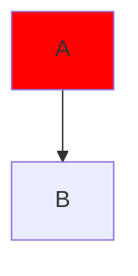

A `:::class` tag is swallowed and the edge survives, spaced or not.



```text
 ┌───┐
 │ A │
 └─┬─┘
   │
   ▼
 ┌───┐
 │ B │
 └───┘
```


```text
┌───┐    ┌───┐
│ A ├───▶│ B │
└───┘    └───┘
```

```mermaid
flowchart LR
  A:::x-->B
```

```text
┌───┐    ┌───┐
│ A ├───▶│ B │
└───┘    └───┘
```
