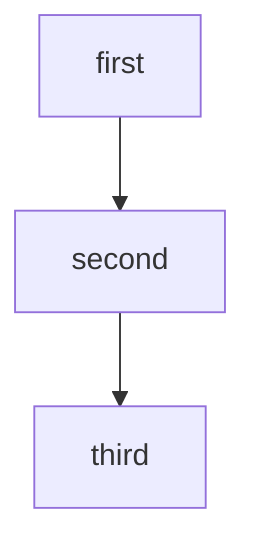
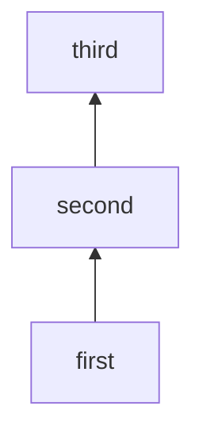

The same chain in all four directions. LR/RL is far shorter than TD/BT;
BT and RL flip the order.



```text
 ┌───────┐
 │ first │
 └───┬───┘
     │
     ▼
┌────────┐
│ second │
└────┬───┘
     │
     ▼
 ┌───────┐
 │ third │
 └───────┘
```


```text
┌───────┐    ┌────────┐    ┌───────┐
│ first ├───▶│ second ├───▶│ third │
└───────┘    └────────┘    └───────┘
```



```text
 ┌───────┐
 │ third │
 └───────┘
     ▲
     │
┌────┴───┐
│ second │
└────────┘
     ▲
     │
 ┌───┴───┐
 │ first │
 └───────┘
```


```text
┌───────┐    ┌────────┐    ┌───────┐
│ third │◄───┤ second │◄───┤ first │
└───────┘    └────────┘    └───────┘
```
