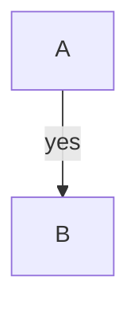
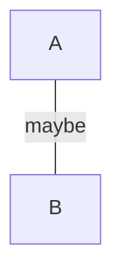
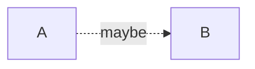
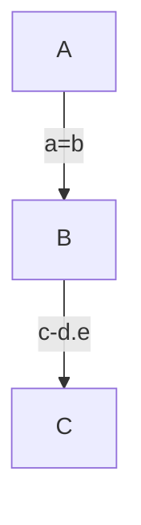
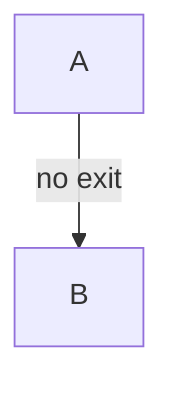
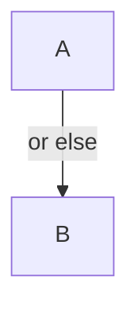

A piped edge label renders on the edge.



```text
 ┌───┐
 │ A │
 └─┬─┘
   │
   ▼yes
 ┌───┐
 │ B │
 └───┘
```

An undirected labelled link draws no arrowhead.



```text
 ┌───┐
 │ A │
 └─┬─┘
   │
   │maybe
 ┌───┐
 │ B │
 └───┘
```

The dotted inline-label form renders dashed.



```text
┌───┐ maybe  ┌───┐
│ A ├╌╌╌╌╌╌╌▶│ B │
└───┘        └───┘
```

An inline label may contain `=`, `.` or `-`, quoted or not — only a
closing operator (two link chars) ends it
([#2](https://github.com/xl0/lovely-mermaid/issues/2)).



```text
 ┌───┐
 │ A │
 └─┬─┘
   │
   ▼a=b
 ┌───┐
 │ B │
 └─┬─┘
   │
   ▼c-d.e
 ┌───┐
 │ C │
 └───┘
```

Inline labels that start with `o` or `x` are labels, not edge markers.



```text
 ┌───┐
 │ A │
 └─┬─┘
   │
   ▼no exit
 ┌───┐
 │ B │
 └───┘
```



```text
 ┌───┐
 │ A │
 └─┬─┘
   │
   ▼or else
 ┌───┐
 │ B │
 └───┘
```
