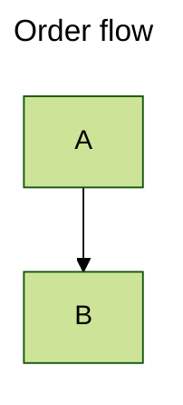

# Frontmatter

A YAML frontmatter block is part of the mermaid grammar; its `title:` is
drawn centred above the art and the rest is skipped.



```text
Order flow

 ┌───┐
 │ A │
 └─┬─┘
   │
   ▼
 ┌───┐
 │ B │
 └───┘
```
