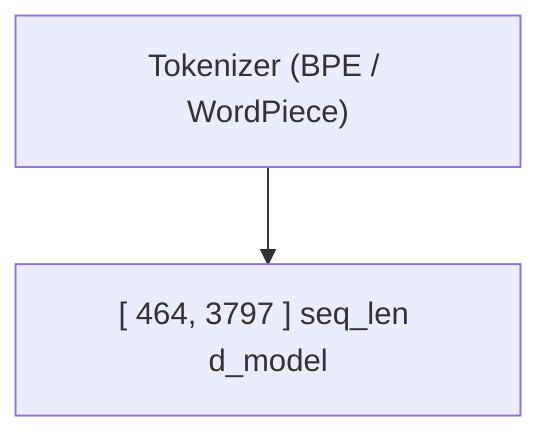

A quoted label with inner brackets or parens is one node.



```text
   ┌──────────────────┐
   │ Tokenizer (BPE / │
   │    WordPiece)    │
   └─────────┬────────┘
             │
             ▼
 ┌───────────────────────┐
 │ [ 464, 3797 ] seq_len │
 │        d_model        │
 └───────────────────────┘
```

An unquoted label with an embedded quote closes at the bracket.

```mermaid
flowchart TD
  A[5" pipe] --> B[24" display]
```

```text
   ┌─────────┐
   │ 5" pipe │
   └────┬────┘
        │
        ▼
 ┌─────────────┐
 │ 24" display │
 └─────────────┘
```

A semicolon and a `%%` survive inside a quoted label; comments outside
quotes are stripped.

```mermaid
graph TD %% main flow
  A["wait; 50%% done"] --> B %% trailing
  %% full line
```

```text
 ┌─────────────────┐
 │ wait; 50%% done │
 └────────┬────────┘
          │
          ▼
        ┌───┐
        │ B │
        └───┘
```
