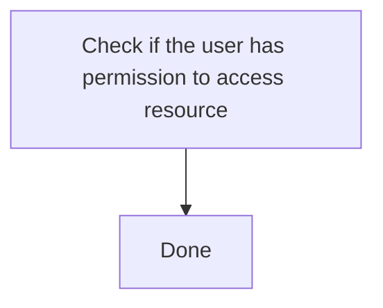
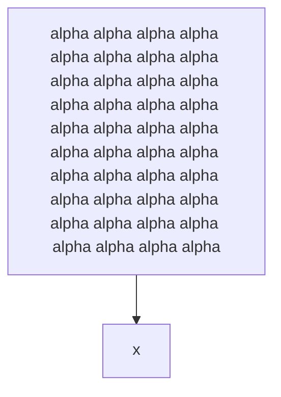
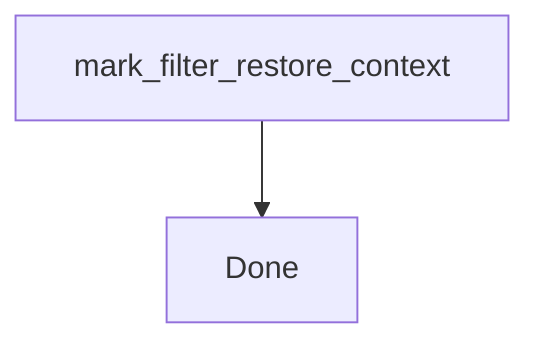
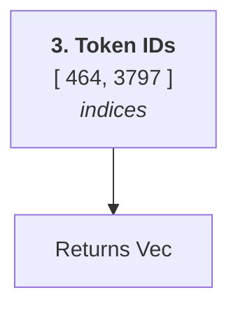
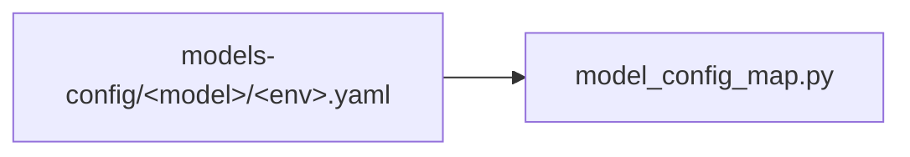
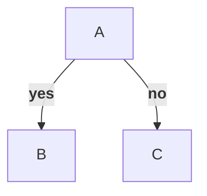
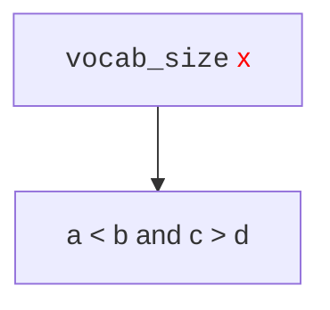

A long label wraps inside the box without truncation.



```text
 ┌───────────────────────┐
 │ Check if the user has │
 │ permission to access  │
 │       resource        │
 └───────────┬───────────┘
             │
             ▼
         ┌──────┐
         │ Done │
         └──────┘
```

A very long label truncates with an ellipsis after the line cap.



```text
┌──────────────────────────┐
│ alpha alpha alpha alpha  │
│ alpha alpha alpha alpha  │
│ alpha alpha alpha alpha  │
│ alpha alpha alpha alpha… │
└─────────────┬────────────┘
              │
              ▼
            ┌───┐
            │ x │
            └───┘
```

A long identifier breaks on a `_` boundary, not mid-segment.



```text
┌──────────────────────┐
│ mark_filter_restore_ │
│       context        │
└───────────┬──────────┘
            │
            ▼
        ┌──────┐
        │ Done │
        └──────┘
```

Wide glyphs measure two columns; the box stays aligned.


```text
┌──────────┐
│ 日本語ab │
└──────────┘
```

HTML formatting tags are stripped, `<br/>` becomes a space; generic types
like `Vec<String>` survive.



```text
┌──────────────────────────┐
│ 3. Token IDs [ 464, 3797 │
│        ] indices         │
└─────────────┬────────────┘
              │
              ▼
   ┌─────────────────────┐
   │ Returns Vec<String> │
   └─────────────────────┘
```

HTML entities decode in the art.



```text
┌────────────────────────┐
│ models-config/<model>/ │    ┌─────────────────────┐
│       <env>.yaml       ├───▶│ model_config_map.py │
└────────────────────────┘    └─────────────────────┘
```

Markdown edge labels are stripped too.



```text
     ┌───┐
     │ A │
     └─┬─┘
   ┌───┴───┐
   ▼yes    ▼no
 ┌───┐   ┌───┐
 │ B │   │ C │
 └───┘   └───┘
```

Code and span tags are stripped; bare angle brackets are kept.



```text
  ┌──────────────┐
  │ vocab_size x │
  └───────┬──────┘
          │
          ▼
 ┌─────────────────┐
 │ a < b and c > d │
 └─────────────────┘
```

Markdown strings strip bold, italic and inline code.

```mermaid
flowchart TD
  A["`**Start** here`"] --> B["`Save to **database**`"]
  B --> C["`_italic_ uses `vocab_size` with __all__`"]
```

```text
      ┌────────────┐
      │ Start here │
      └──────┬─────┘
             │
             ▼
   ┌──────────────────┐
   │ Save to database │
   └─────────┬────────┘
             │
             ▼
┌────────────────────────┐
│ italic uses vocab_size │
│        with all        │
└────────────────────────┘
```
