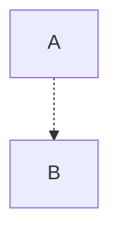
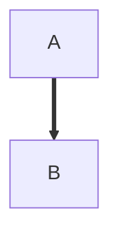
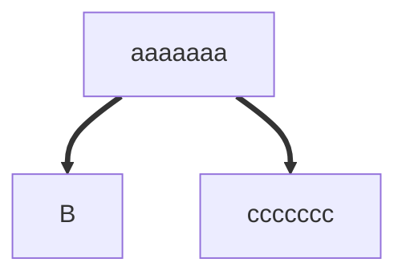
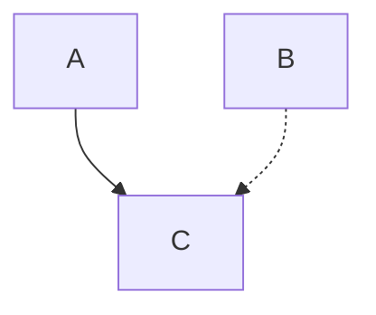

Dotted and thick lines render distinctly; a plain solid edge uses neither.



```text
 ┌───┐
 │ A │
 └─┬─┘
   ╎
   ▼
 ┌───┐
 │ B │
 └───┘
```



```text
 ┌───┐
 │ A │
 └─┬─┘
   ┃
   ▼
 ┌───┐
 │ B │
 └───┘
```

Box borders stay light next to a thick edge, and a thick jog uses thick
corners.



```text
   ┌─────────┐
   │ aaaaaaa │
   └────┬────┘
   ┏━━━━┻━━━━━┓
   ▼          ▼
 ┌───┐   ┌─────────┐
 │ B │   │ ccccccc │
 └───┘   └─────────┘
```

A mixed solid and dotted bus stays light.



```text
 ┌───┐   ┌───┐
 │ A │   │ B │
 └─┬─┘   └─┬─┘
   └───┬╌╌╌┘
       ▼
     ┌───┐
     │ C │
     └───┘
```
