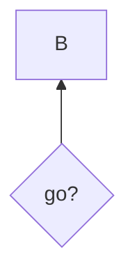
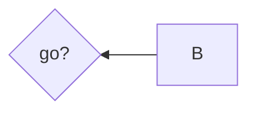
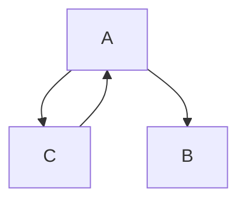
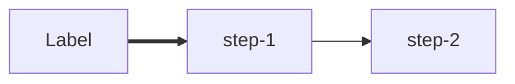
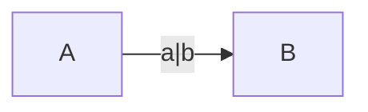
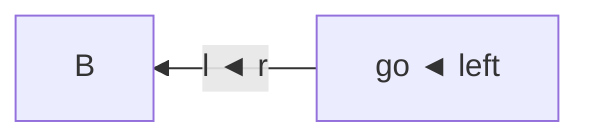
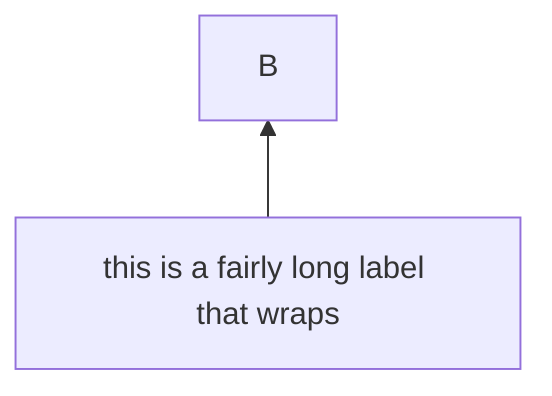

# Flowchart regressions

Double-border diamonds flip with the canvas: `BT` mirrors the corners and
tees vertically (`╔` up top, `╤` → `╧`), `RL` horizontally.



```text
  ┌───┐
  │ B │
  └───┘
    ▲
    │
 ╔══╧══╗
 ║ go? ║
 ╚═════╝
```



```text
╔═════╗    ┌───┐
║ go? ║◄───┤ B │
╚═════╝    └───┘
```

A `:::` tag glued to a link operator backs off the trailing dashes, keeping
the link (the span classes it assigns are pinned in parse.test.ts).

```mermaid
graph TD
  A:::x-->B
```

```text
 ┌───┐
 │ A │
 └─┬─┘
   │
   ▼
 ┌───┐
 │ B │
 └───┘
```

A back edge routes around its rank through the side lane — its endpoint
orders rightmost, so the run to the lane does not cut through `B`.



```text
     ┌───┐
     │ A │◄────┐
     └─┬─┘     │
   ┌───┴───┐   │
   ▼       ▼   │
 ┌───┐   ┌───┐ │
 │ B │   │ C ├─┘
 └───┘   └───┘
```

Kebab-case ids parse as one id: `-` joins when an id char follows, while
`-->`/`-.`/`==` still terminate. Previously `step-1-->step-2` self-looped
on `step`.



```text
┌───────┐    ┌────────┐    ┌────────┐
│ Label ├━━━▶│ step-1 ├───▶│ step-2 │
└───────┘    └────────┘    └────────┘
```

A quoted stretch inside a `|label|` keeps its pipes as text.



```text
┌───┐ a|b  ┌───┐
│ A ├─────▶│ B │
└───┘      └───┘
```

Arrow and box-drawing characters inside user text survive RL/BT flips —
the glyph remap applies to structure, not authored cells.



```text
┌───┐  l ◄ r ┌───────────┐
│ B │◄───────┤ go ◄ left │
└───┘        └───────────┘
```

BT restores reading order of multi-row content: wrapped labels read
top-down, not bottom-up.



```text
           ┌───┐
           │ B │
           └───┘
             ▲
             │
 ┌───────────┴───────────┐
 │ this is a fairly long │
 │   label that wraps    │
 └───────────────────────┘
```
