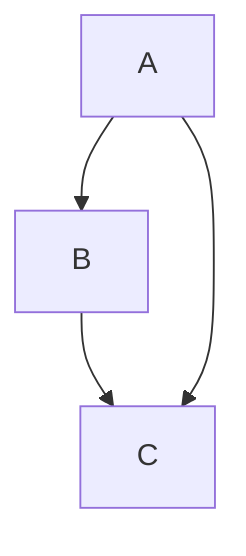
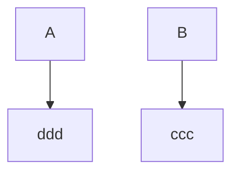
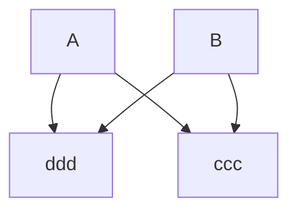
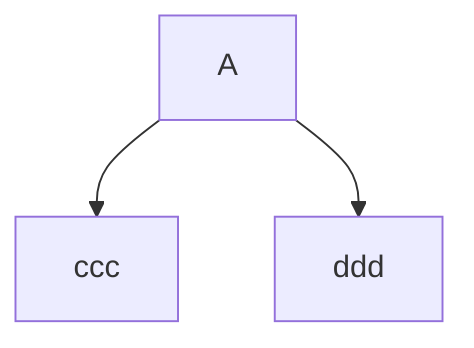
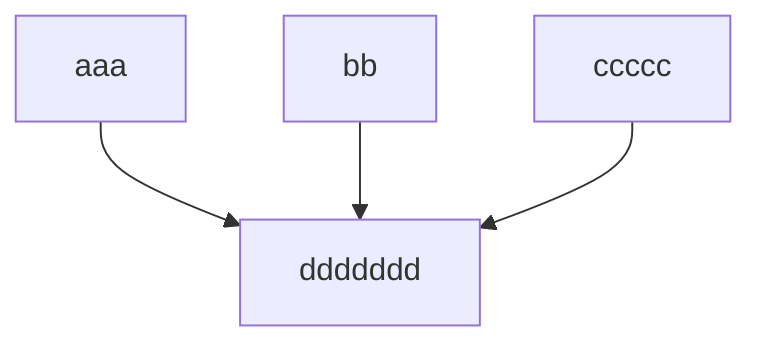
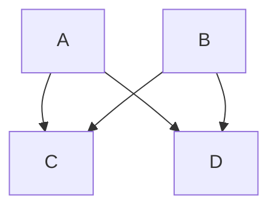
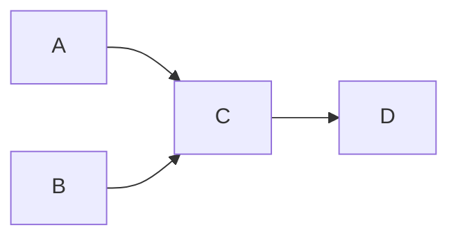

A skip edge routes around the intermediate box and re-enters through the
target's top, beside the forward arrival.



```text
 ┌───┐
 │ A ├─┐
 └─┬─┘ │
   │   │
   ▼   │
 ┌───┐ │
 │ B │ │
 └─┬─┘ │
  ┌┼───┘
  ▼▼
 ┌───┐
 │ C │
 └───┘
```

An avoidable crossing is untangled by reordering.



```text
  ┌───┐     ┌───┐
  │ A │     │ B │
  └─┬─┘     └─┬─┘
    │         │
    ▼         ▼
 ┌─────┐   ┌─────┐
 │ ddd │   │ ccc │
 └─────┘   └─────┘
```

An unavoidable crossing claims a separate bus row.



```text
   ┌───┐   ┌───┐
   │ A │   │ B │
   └┬┬─┘   └─┬┬┘
    ├┼───────┘│
    │└────────┤
    ▼         ▼
 ┌─────┐   ┌─────┐
 │ ddd │   │ ccc │
 └─────┘   └─────┘
```

A fan-out keeps a single bus row; a merge draws a single arrowhead.



```text
       ┌───┐
       │ A │
       └─┬─┘
    ┌────┴────┐
    ▼         ▼
 ┌─────┐   ┌─────┐
 │ ccc │   │ ddd │
 └─────┘   └─────┘
```



```text
 ┌─────┐  ┌────┐    ┌───────┐
 │ aaa │  │ bb │    │ ccccc │
 └──┬──┘  └───┬┘    └───┬───┘
    └─────────┼─────────┘
              ▼
         ┌─────────┐
         │ ddddddd │
         └─────────┘
```

`&` fans out the cross product, one arrowhead per target.



```text
 ┌───┐   ┌───┐
 │ A │   │ B │
 └─┬─┘   └─┬─┘
   ├───────┤
   ├───────┤
   ▼       ▼
 ┌───┐   ┌───┐
 │ C │   │ D │
 └───┘   └───┘
```

A fan mid-chain continues from the whole group; a reversed arrow fans the
sources.



```text
┌───┐
│ A ├┐
└───┘│   ┌───┐    ┌───┐
     ├──▶│ C ├───▶│ D │
┌───┐│   └───┘    └───┘
│ B ├┘
└───┘
```

```mermaid
graph TD
  A & B <-- C
```

```text
     ┌───┐
     │ C │
     └─┬─┘
   ┌───┴───┐
   ▼       ▼
 ┌───┐   ┌───┐
 │ A │   │ B │
 └───┘   └───┘
```
