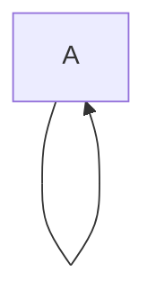
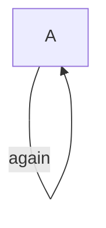
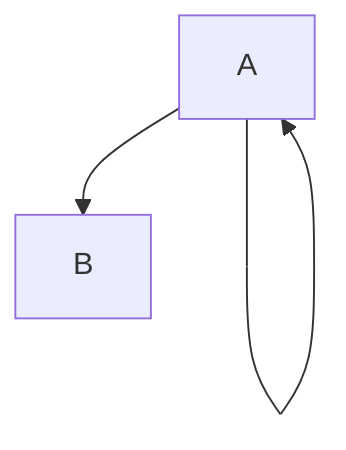
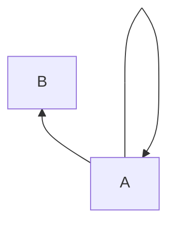
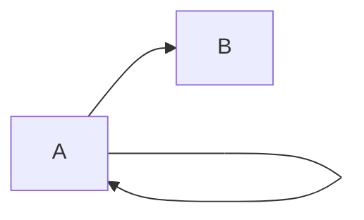

A self loop renders below the box, arrow pointing back up.



```text
 ┌─────┐
 │  A  │
 └───┬─┘
     │▲
     ╰╯
```



```text
         ┌─────┐
         │  A  │
         └───┬─┘
             │▲  again
             ╰╯
```

A self loop coexists with a forward edge without crossings.



```text
 ┌─────┐
 │  A  │
 └──┬┬─┘
    ││▲
    │╰╯
    │
    ▼
  ┌───┐
  │ B │
  └───┘
```

BT flips the loop above the box; LR keeps it below.



```text
  ┌───┐
  │ B │
  └───┘
    ▲
    │
    │╭╮
    ││▼
 ┌──┴┴─┐
 │  A  │
 └─────┘
```



```text
┌─────┐
│  A  ├┐   ┌───┐
└───┬─┘└──▶│ B │
    │▲     └───┘
    ╰╯
```
