A subgraph renders a titled frame; edges to the subgraph id attach to the
frame.

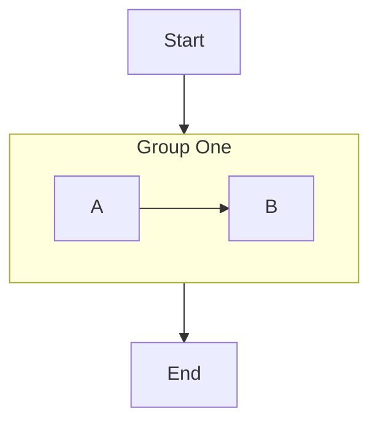

```text
   ┌───────┐
   │ Start │
   └───┬───┘
       │
       ▼
 ┌ Group One ┐
 │   ┌───┐   │
 │   │ A │   │
 │   └─┬─┘   │
 │     │     │
 │     ▼     │
 │   ┌───┐   │
 │   │ B │   │
 │   └───┘   │
 └─────┬─────┘
       │
       ▼
    ┌─────┐
    │ End │
    └─────┘
```

An edge between two subgraphs ranks their frames.

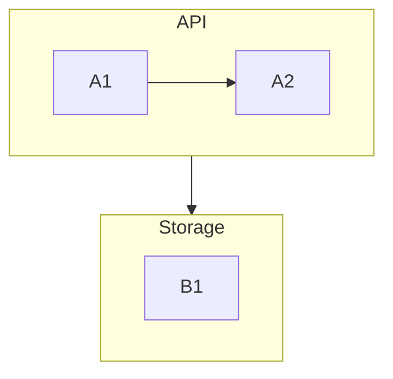

```text
 ┌ API ───┐
 │ ┌────┐ │
 │ │ A1 │ │
 │ └──┬─┘ │
 │    │   │
 │    ▼   │
 │ ┌────┐ │
 │ │ A2 │ │
 │ └────┘ │
 └────┬───┘
      │
      ▼
 ┌ Storage ┐
 │ ┌────┐  │
 │ │ B1 │  │
 │ └────┘  │
 └─────────┘
```

Subgraphs nest.

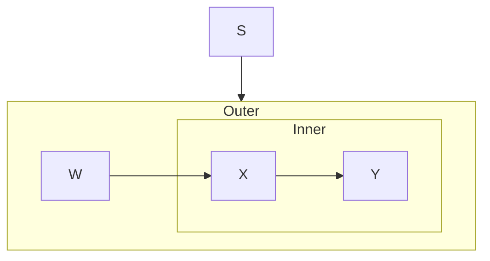

```text
     ┌───┐
     │ S │
     └─┬─┘
       │
       ▼
┌ Outer ─────┐
│    ┌───┐   │
│    │ W │   │
│    └─┬─┘   │
│      │     │
│      ▼     │
│ ┌ Inner ─┐ │
│ │  ┌───┐ │ │
│ │  │ X │ │ │
│ │  └─┬─┘ │ │
│ │    │   │ │
│ │    ▼   │ │
│ │  ┌───┐ │ │
│ │  │ Y │ │ │
│ │  └───┘ │ │
│ └────────┘ │
└────────────┘
```

A cross-member edge pierces the frame and attaches to the node inside when
the corridor is clear; otherwise it attaches to the frame.

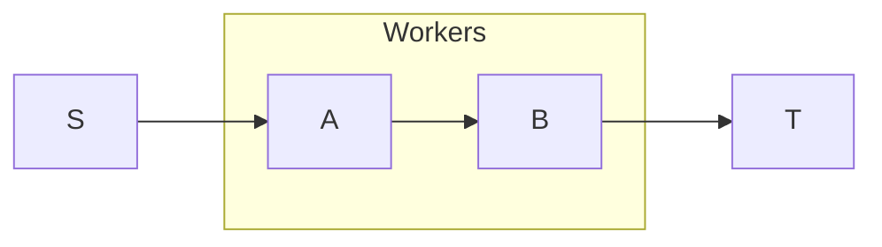

```text
                  ┌ Workers ┐
                  │         │
┌───┐    ┌───┐    │  ┌───┐  │    ┌───┐
│ S ├───▶│ A ├────┼─▶│ B ├──┼───▶│ T │
└───┘    └───┘    │  └───┘  │    └───┘
                  └─────────┘
```

A subgraph id referenced before its declaration titles the frame.

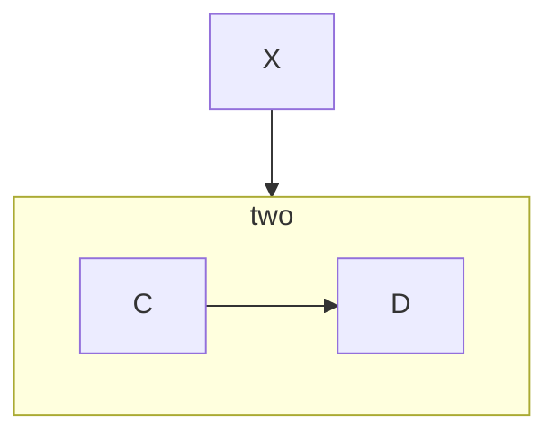

```text
   ┌───┐
   │ X │
   └─┬─┘
     │
     ▼
┌ two ───┐
│  ┌───┐ │
│  │ C │ │
│  └─┬─┘ │
│    │   │
│    ▼   │
│  ┌───┐ │
│  │ D │ │
│  └───┘ │
└────────┘
```

Quoted, multi-word and entity-escaped titles.

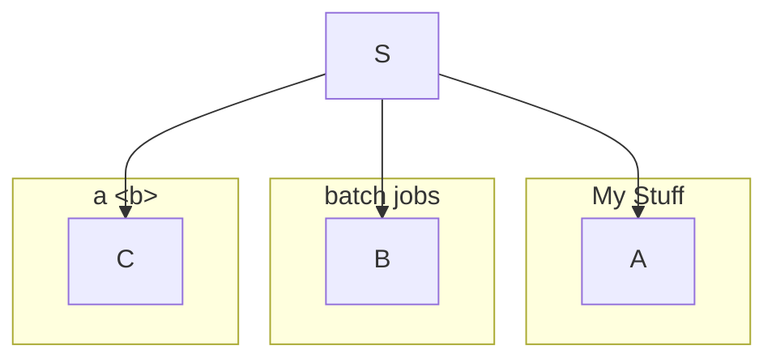

```text
                    ┌───┐
                    │ S │
                    └─┬─┘
      ┌───────────────┼──────────────┐
      ▼               ▼              ▼
┌ My Stuff ┐   ┌ batch jobs ┐   ┌ a <b> ─┐
│   ┌───┐  │   │    ┌───┐   │   │  ┌───┐ │
│   │ A │  │   │    │ B │   │   │  │ C │ │
│   └───┘  │   │    └───┘   │   │  └───┘ │
└──────────┘   └────────────┘   └────────┘
```

An empty subgraph is dropped.

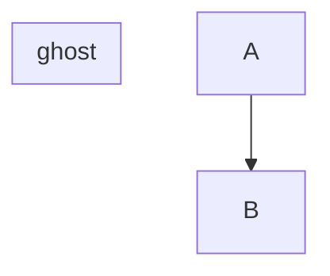

```text
 ┌───┐
 │ A │
 └─┬─┘
   │
   ▼
 ┌───┐
 │ B │
 └───┘
```

BT flips a frame and its contents; the title stays on the top border.

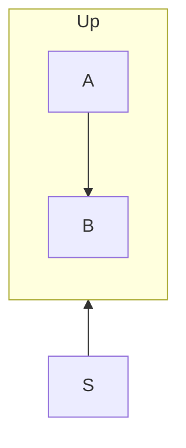

```text
┌ Up ────┐
│  ┌───┐ │
│  │ B │ │
│  └───┘ │
│    ▲   │
│    │   │
│  ┌─┴─┐ │
│  │ A │ │
│  └───┘ │
└────────┘
     ▲
     │
   ┌─┴─┐
   │ S │
   └───┘
```

Nesting past the depth cap draws nothing.

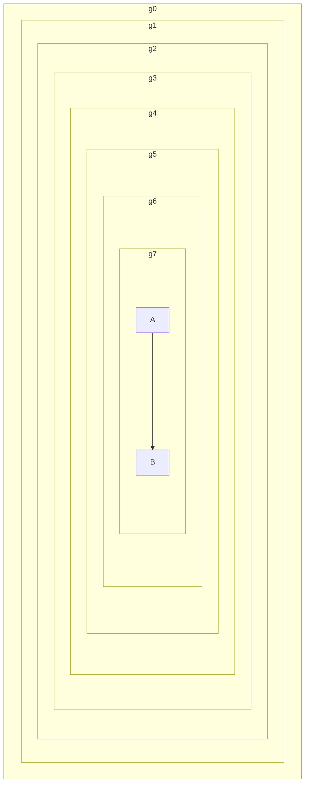

(null)

A subgraph `direction` statement overrides the layout inside its frame;
flipping values (BT/RL) are ignored, as is `direction` under a flipped root.

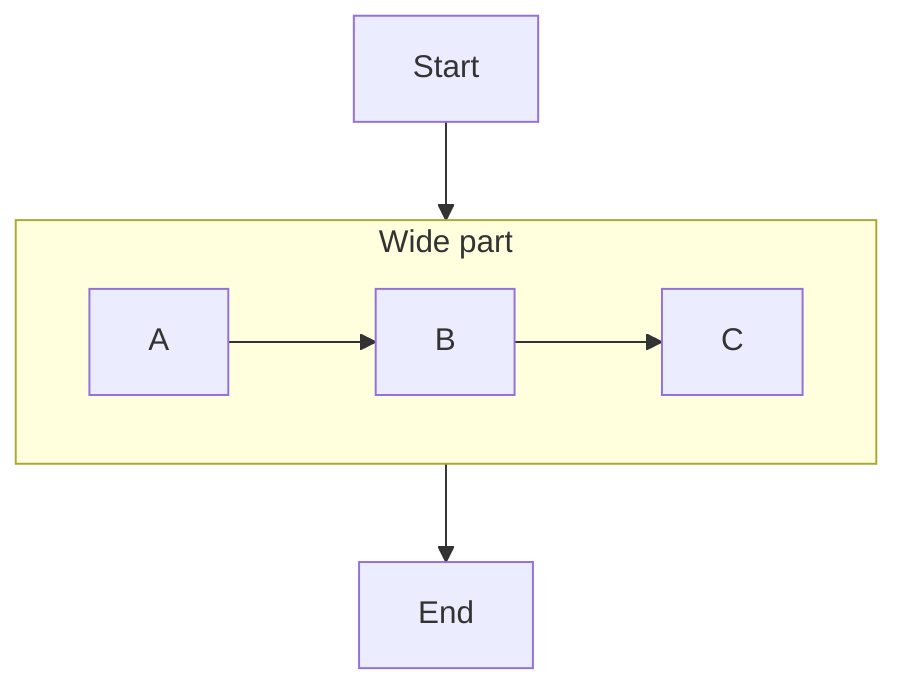

```text
          ┌───────┐
          │ Start │
          └───┬───┘
              │
              ▼
 ┌ Wide part ──────────────┐
 │                         │
 │ ┌───┐    ┌───┐    ┌───┐ │
 │ │ A ├───▶│ B ├───▶│ C │ │
 │ └───┘    └───┘    └───┘ │
 └────────────┬────────────┘
              │
              ▼
           ┌─────┐
           │ End │
           └─────┘
```

A node linked from outside its subgraph voids the subgraph's `direction`
(mermaid's rule): the group inherits the parent direction instead.

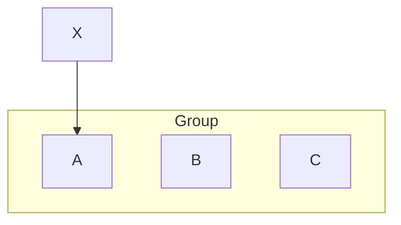

```text
           ┌───┐
           │ X │
           └─┬─┘
             │
             ▼
┌ Group ─────────────────┐
│  ┌───┐   ┌───┐   ┌───┐ │
│  │ A │   │ B │   │ C │ │
│  └───┘   └───┘   └───┘ │
└────────────────────────┘
```
