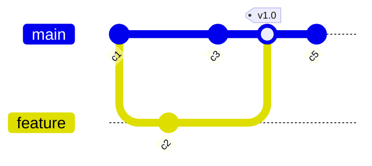
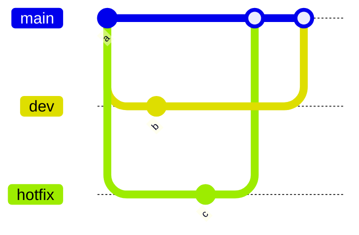

# Git graphs

Commit lanes in `git log --graph` style: newest on top, one column per
branch, splits and merges as connector rows.



```text
●   c5 (main)
●   [v1.0] ⇐ feature
├─┐
● │ c3
│ ● c2 (feature)
├─┘
●   c1
```

A merge across an in-between lane crosses it rather than erasing it.



```text
●     (main) ⇐ dev
├─┐
● │   ⇐ hotfix
├─┼─┐
│ │ ● c (hotfix)
│ ● │ b (dev)
├─┼─┘
├─┘
●     a
```
