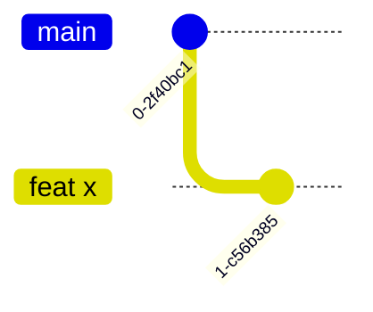

Quoted branch names carry spaces and keywords; the quotes are not part of
the name. Previously the head label rendered `("feat`.


```mermaid
gitGraph
  commit
  branch "feat x"
  commit
```

```text
  ● c1 (feat x)
┌─┘
●   c0 (main)
```
