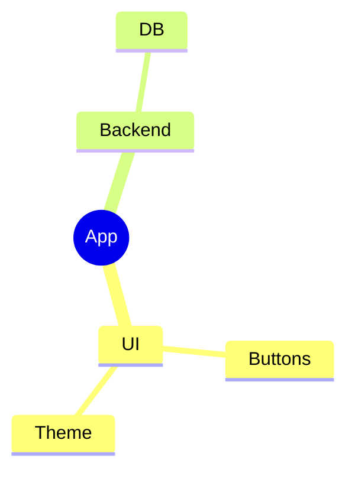

# Mindmaps

An indentation tree, drawn with the guides every TUI uses.


```mermaid
mindmap
  root((App))
    UI
      Buttons
      Theme
    Backend
      DB
```

```text
App
├── UI
│   ├── Buttons
│   └── Theme
└── Backend
    └── DB
```
