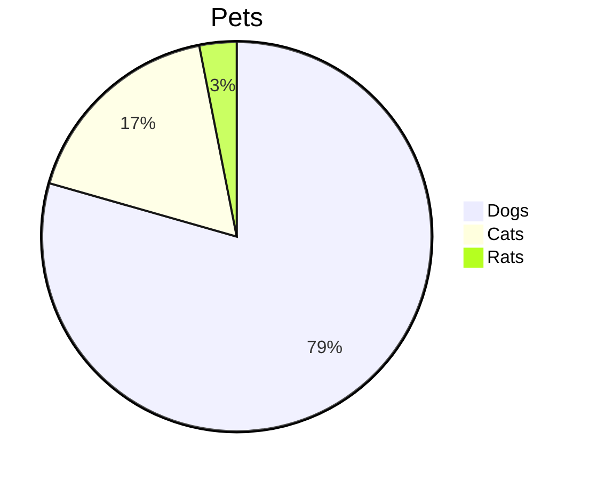
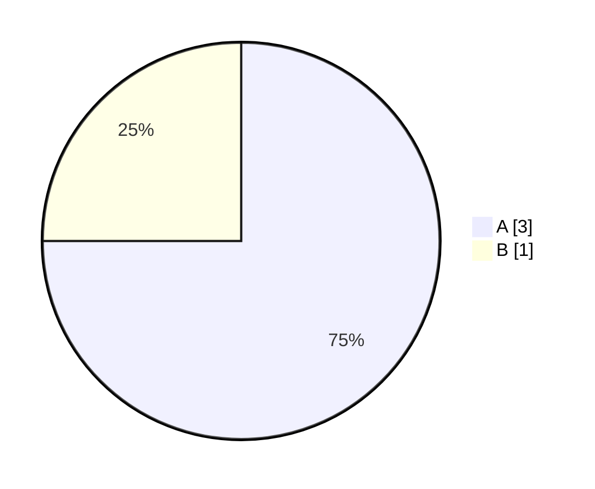
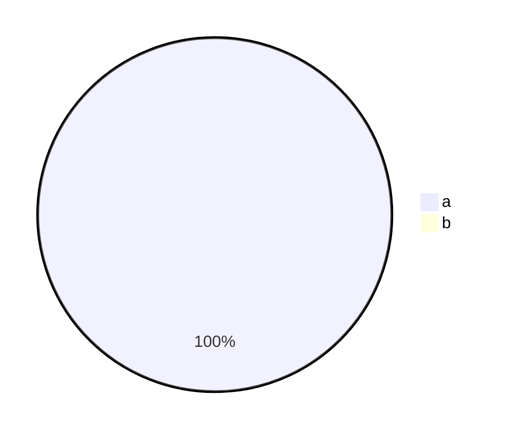

# Pie charts

Proportions as a labelled bar list — a terminal has no circles worth drawing.



```text
             Pets
Dogs  ███████████████▉      79%
Cats  ███▌                  17%
Rats  ▋                      3%
```

`showData` appends the raw values.



```text
A  ███████████████       75%  (3)
B  █████                 25%  (1)
```

Eighth-block rounding carries into a full cell: 999 of 1000 is a full bar,
not a dropped fraction.



```text
a  ████████████████████ 100%
b  ▏                      0%
```
