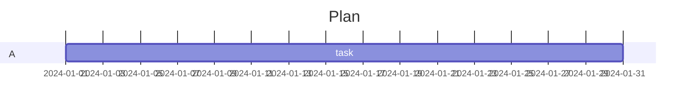

# Refusals

Diagram types this renderer does not draw return `null` — the caller shows
the source box.



(null)

Upstream accepts junk header suffixes like `stateDiagramFoo` by prefix
match; mermaid proper — and this port — reject them.

```mermaid
stateDiagramFoo
  A --> B
```

(null)
