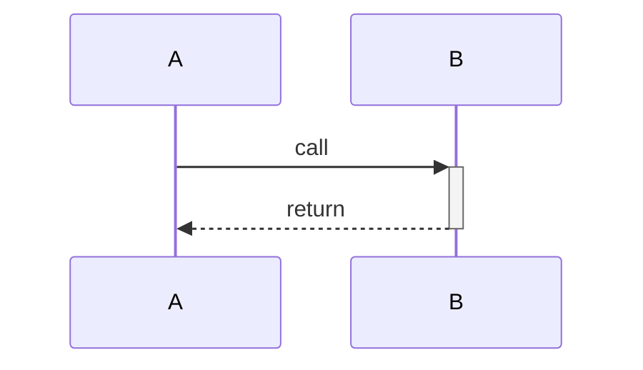
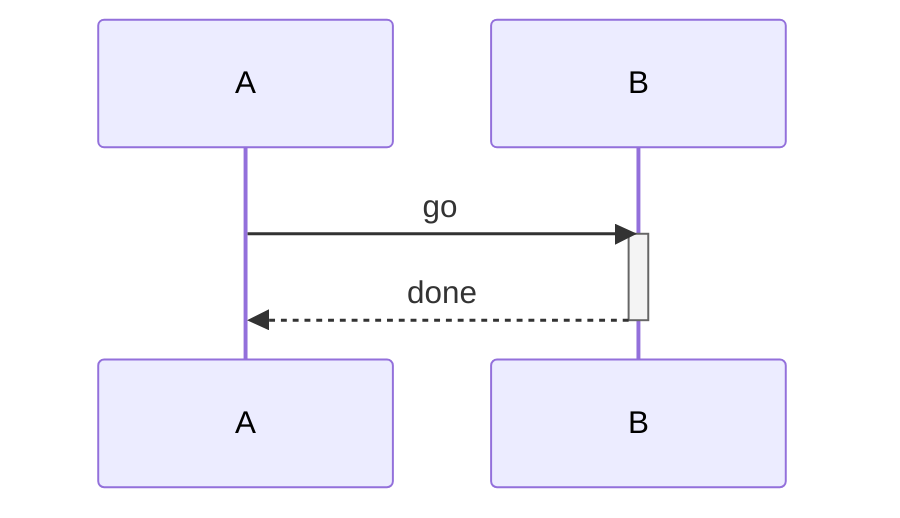
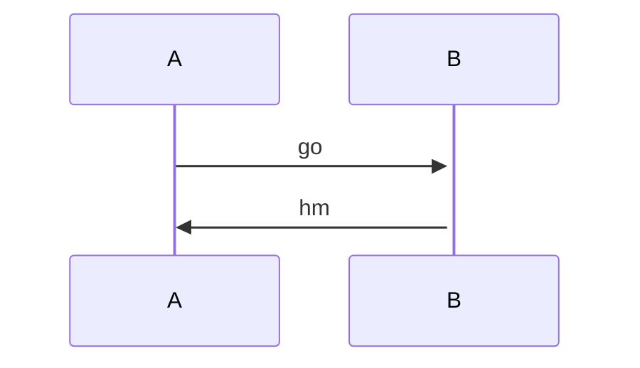

`+`/`-` marks thicken the receiver's lifeline between call and return.



```text
┌───┐   ┌───┐
│ A │   │ B │
└─┬─┘   └─┬─┘
  │       │
  │ call  │
  ├──────▶║
  │       ║
  │return ║
  │◄╌╌╌╌╌╌╢
  │       │
┌─┴─┐   ┌─┴─┐
│ A │   │ B │
└───┘   └───┘
```

`activate`/`deactivate` statements drive the lifeline too.



```text
┌───┐  ┌───┐
│ A │  │ B │
└─┬─┘  └─┬─┘
  │      │
  │  go  │
  ├─────▶║
  │      ║
  │ done ║
  │◄╌╌╌╌╌╢
  │      │
┌─┴─┐  ┌─┴─┐
│ A │  │ B │
└───┘  └───┘
```

An unclosed activation runs to the bottom.



```text
┌───┐  ┌───┐
│ A │  │ B │
└─┬─┘  └─┬─┘
  │      │
  │  go  │
  ├─────▶║
  │      ║
  │  hm  ║
  │◄─────╢
  │      ║
┌─┴─┐  ┌─┴─┐
│ A │  │ B │
└───┘  └───┘
```
