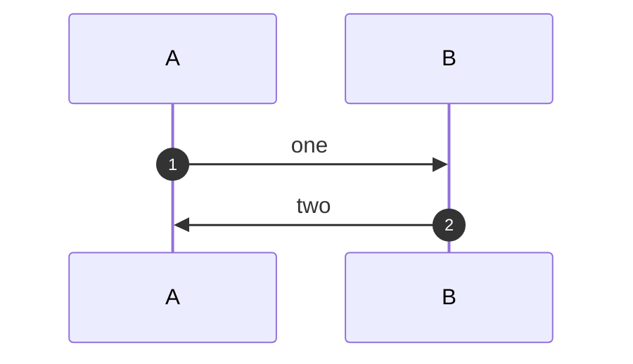

`autonumber` prefixes messages.



```text
┌───┐   ┌───┐
│ A │   │ B │
└─┬─┘   └─┬─┘
  │       │
  │1. one │
  ├──────▶│
  │       │
  │2. two │
  │◄──────┤
  │       │
┌─┴─┐   ┌─┴─┐
│ A │   │ B │
└───┘   └───┘
```
