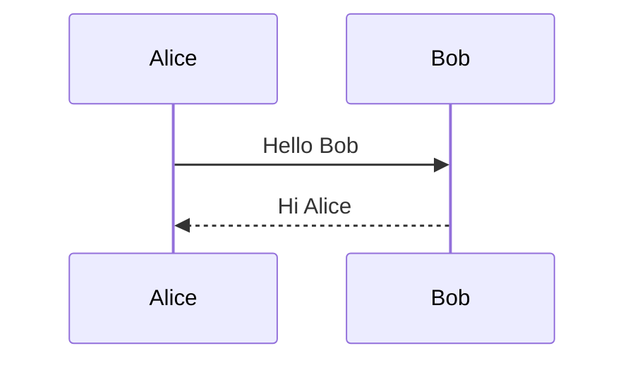
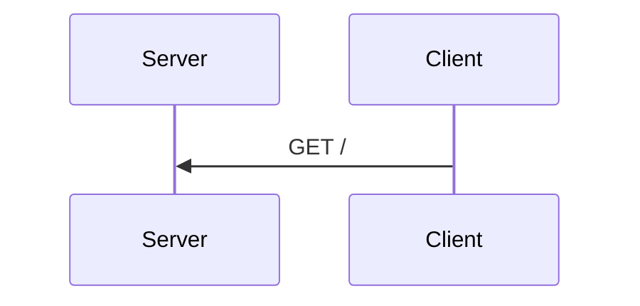
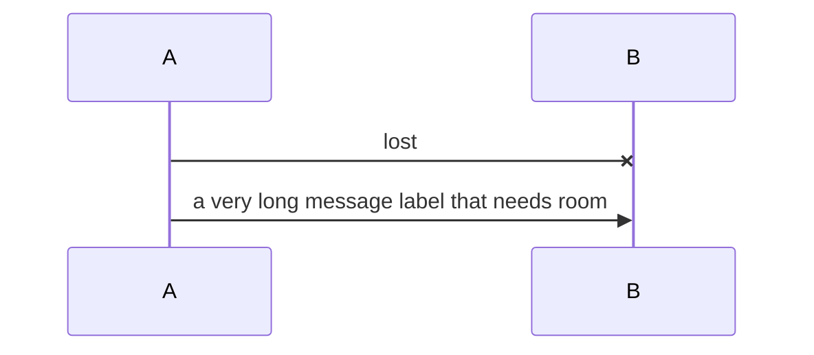

Actors, solid and dotted messages, arrowheads both ways.



```text
┌───────┐   ┌─────┐
│ Alice │   │ Bob │
└───┬───┘   └──┬──┘
    │          │
    │Hello Bob │
    ├─────────▶│
    │          │
    │ Hi Alice │
    │◄╌╌╌╌╌╌╌╌╌┤
    │          │
┌───┴───┐   ┌──┴──┐
│ Alice │   │ Bob │
└───────┘   └─────┘
```

Participant aliases render their labels; declared order wins.



```text
┌────────┐ ┌────────┐
│ Server │ │ Client │
└────┬───┘ └────┬───┘
     │          │
     │  GET /   │
     │◄─────────┤
     │          │
┌────┴───┐ ┌────┴───┐
│ Server │ │ Client │
└────────┘ └────────┘
```

A cross head marks a lost message; a long label widens the gap.



```text
┌───┐                                      ┌───┐
│ A │                                      │ B │
└─┬─┘                                      └─┬─┘
  │                                          │
  │                   lost                   │
  ├─────────────────────────────────────────×│
  │                                          │
  │a very long message label that needs room │
  ├─────────────────────────────────────────▶│
  │                                          │
┌─┴─┐                                      ┌─┴─┐
│ A │                                      │ B │
└───┘                                      └───┘
```
