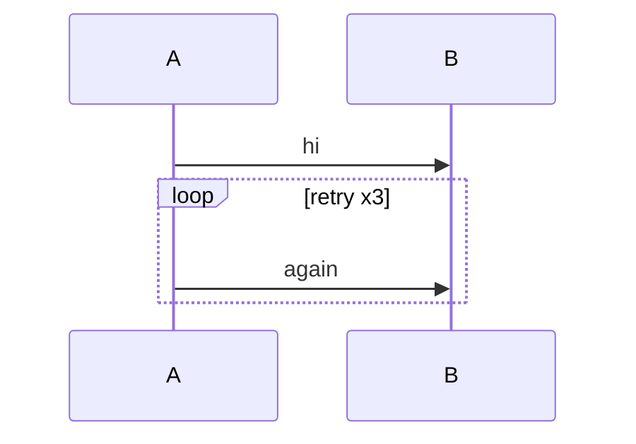
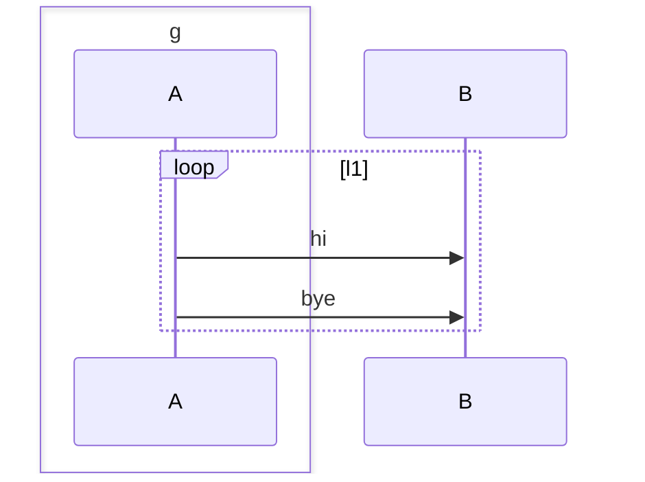
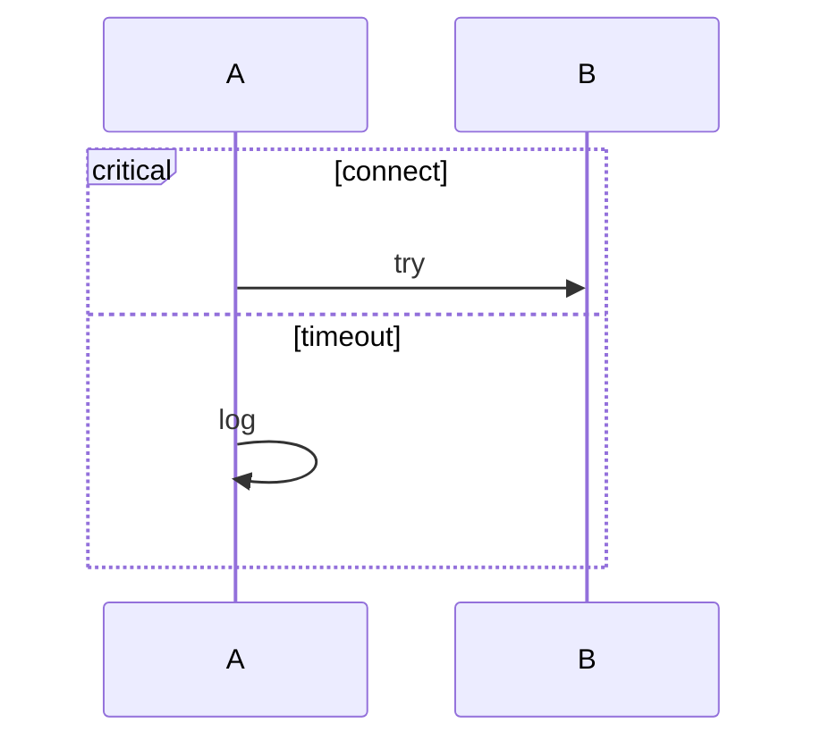

A loop renders a divider and an end.



```text
┌───┐  ┌───┐
│ A │  │ B │
└─┬─┘  └─┬─┘
  │      │
  │  hi  │
  ├─────▶│
  │      │
── loop retry x3
  │      │
  │again │
  ├─────▶│
  │      │
── end ──────────
  │      │
┌─┴─┐  ┌─┴─┐
│ A │  │ B │
└───┘  └───┘
```

A rect block is invisible.

```mermaid
sequenceDiagram
  rect rgb(0,0,0)
    A->>B: hi
  end
```



```text
┌───┐  ┌───┐
│ A │  │ B │
└─┬─┘  └─┬─┘
  │      │
  │  hi  │
  ├─────▶│
  │      │
┌─┴─┐  ┌─┴─┐
│ A │  │ B │
└───┘  └───┘
```

A `box ... end` does not close the enclosing block.



```text
┌───┐  ┌───┐
│ A │  │ B │
└─┬─┘  └─┬─┘
  │      │
── loop l1 ──
  │      │
  │  hi  │
  ├─────▶│
  │      │
  │ bye  │
  ├─────▶│
  │      │
── end ──────
  │      │
┌─┴─┐  ┌─┴─┐
│ A │  │ B │
└───┘  └───┘
```

`critical` and `option` render dividers.



```text
┌───┐     ┌───┐
│ A │     │ B │
└─┬─┘     └─┬─┘
  │         │
── critical connect
  │         │
  │   try   │
  ├────────▶│
  │         │
── option timeout ──
  │         │
  ├──╮      │
  │  │ log  │
  │◄─╯      │
  │         │
── end ─────────────
  │         │
┌─┴─┐     ┌─┴─┐
│ A │     │ B │
└───┘     └───┘
```
