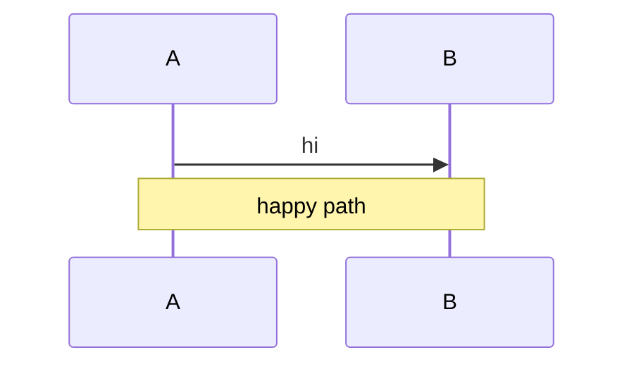
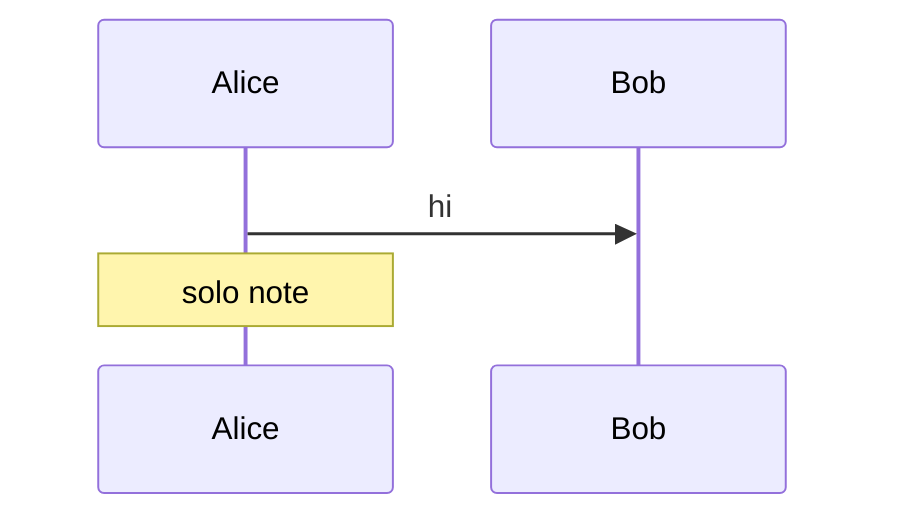

A note over two participants renders a box between them.



```text
┌───┐    ┌───┐
│ A │    │ B │
└─┬─┘    └─┬─┘
  │        │
  │   hi   │
  ├───────▶│
  │        │
┌────────────┐
│ happy path │
└────────────┘
  │        │
┌─┴─┐    ┌─┴─┐
│ A │    │ B │
└───┘    └───┘
```

A solo note over one participant.



```text
┌───────┐  ┌─────┐
│ Alice │  │ Bob │
└───┬───┘  └──┬──┘
    │         │
    │   hi    │
    ├────────▶│
    │         │
┌───────────┐ │
│ solo note │ │
└───────────┘ │
    │         │
┌───┴───┐  ┌──┴──┐
│ Alice │  │ Bob │
└───────┘  └─────┘
```
