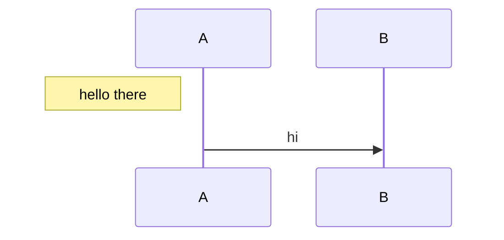

# Sequence regressions

A note left of the first participant gets its own margin instead of painting
over the lifelines.



```text
              ┌───┐  ┌───┐
              │ A │  │ B │
              └─┬─┘  └─┬─┘
                │      │
┌─────────────┐ │      │
│ hello there │ │      │
└─────────────┘ │      │
                │      │
                │  hi  │
                ├─────▶│
                │      │
              ┌─┴─┐  ┌─┴─┐
              │ A │  │ B │
              └───┘  └───┘
```
