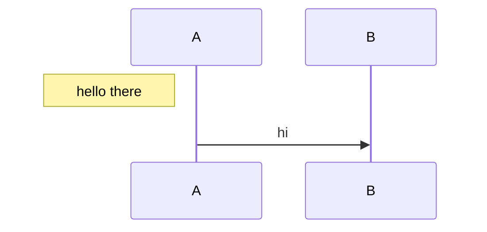

# Sequence regressions

A note left of the first participant gets its own margin instead of painting
over the lifelines.



```text
              ┌───┐  ┌───┐
              │ A │  │ B │
              └─┬─┘  └─┬─┘
                │      │
┌─────────────┐ │      │
│ hello there │ │      │
└─────────────┘ │      │
                │      │
                │  hi  │
                ├─────▶│
                │      │
              ┌─┴─┐  ┌─┴─┐
              │ A │  │ B │
              └───┘  └───┘
```

A `-x` or `-)` inside a hyphenated participant name is not an operator —
the real one follows. Previously `pre-x->>B` invented participant `>>B`.

```mermaid
sequenceDiagram
  pre-x->>B: hi
  svc-a-)svc-b: async
```

```text
┌───────┐  ┌───┐  ┌───────┐  ┌───────┐
│ pre-x │  │ B │  │ svc-a │  │ svc-b │
└───┬───┘  └─┬─┘  └───┬───┘  └───┬───┘
    │        │        │          │
    │   hi   │        │          │
    ├───────▶│        │          │
    │        │        │          │
    │        │        │  async   │
    │        │        ├─────────▶│
    │        │        │          │
┌───┴───┐  ┌─┴─┐  ┌───┴───┐  ┌───┴───┐
│ pre-x │  │ B │  │ svc-a │  │ svc-b │
└───────┘  └───┘  └───────┘  └───────┘
```
