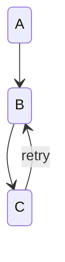

A back transition uses a lane, label included.



```text
 ╭───╮
 │ A │
 ╰─┬─╯
   │
   ▼
 ╭───╮ retry
 │ B │◄──────┐
 ╰─┬─╯       │
   │         │
   ▼         │
 ╭───╮       │
 │ C ├───────┘
 ╰───╯
```
