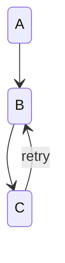

A back transition to the previous rank returns locally, label beside the
arrowhead.


```mermaid
stateDiagram-v2
  A --> B
  B --> C
  C --> B: retry
```

```text
 ╭───╮
 │ A │
 ╰─┬─╯
   │
   ▼
 ╭───╮
 │ B │
 ╰─┬─╯
   │▲retry
   ▼│
 ╭──┴╮
 │ C │
 ╰───╯
```
