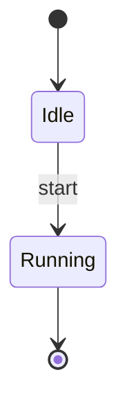
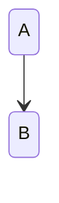
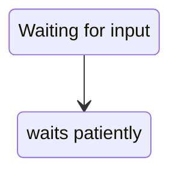

Start and end markers, rounded state boxes, a transition label.



```text
    ╭───╮
    │ ● │
    ╰─┬─╯
      │
      ▼
  ╭──────╮
  │ Idle │
  ╰───┬──╯
      │
      ▼start
 ╭─────────╮
 │ Running │
 ╰────┬────╯
      │
      ▼
    ╭───╮
    │ ● │
    ╰───╯
```

The v1 header renders too.



```text
 ╭───╮
 │ A │
 ╰─┬─╯
   │
   ▼
 ╭───╮
 │ B │
 ╰───╯
```

An alias and a description set the label.



```text
 ╭───────────────────╮
 │ Waiting for input │
 ╰─────────┬─────────╯
           │
           ▼
  ╭─────────────────╮
  │ waits patiently │
  ╰─────────────────╯
```
