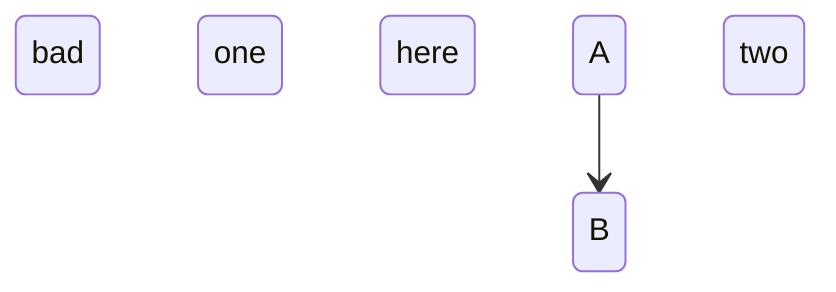
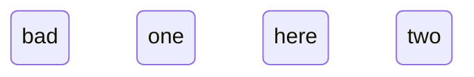

Unreadable statements drop individually with verbatim warnings; the rest
renders.



```text
 ╭───╮
 │ A │
 ╰─┬─╯
   │
   ▼
 ╭───╮
 │ B │
 ╰───╯
```

```warnings
dropped, unreadable statement: "bad one here"
dropped, unreadable statement: "bad two here"
```

A source in which not one statement parses refuses.



(null)

A bad composite declaration keeps the brace balance.

```mermaid
stateDiagram-v2
  state "unclosed {
  A --> B
  }
  B --> C
```

```text
┌────────┐
│  ╭───╮ │
│  │ A │ │
│  ╰─┬─╯ │
│    │   │
│    ▼   │
│  ╭───╮ │
│  │ B │ │
│  ╰─┬─╯ │
└────┼───┘
     │
     ▼
   ╭───╮
   │ C │
   ╰───╯
```

```warnings
dropped, unreadable statement: "state "unclosed {"
```

A dangling chain keeps its parsed prefix.

```mermaid
stateDiagram-v2
  A --> B -->
```

```text
 ╭───╮
 │ A │
 ╰─┬─╯
   │
   ▼
 ╭───╮
 │ B │
 ╰───╯
```

```warnings
dropped, unreadable statement: "A --> B -->"
```
