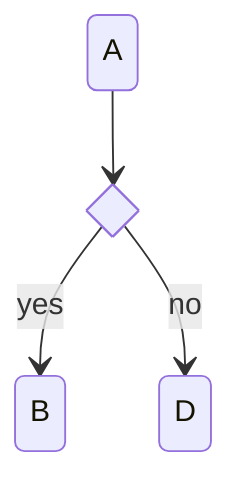

A `<<choice>>` state renders as a diamond.



```text
     ╭───╮
     │ A │
     ╰─┬─╯
       │
       ▼
     ╭───╮
     │ c │
     ╰─┬─╯
   ┌───┴───┐
   ▼yes    ▼no
 ╭───╮   ╭───╮
 │ B │   │ D │
 ╰───╯   ╰───╯
```
