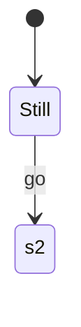

`:::class` tags are swallowed everywhere a state id appears.


```mermaid
stateDiagram-v2
  [*] --> Still:::bad
  Still:::bad --> s2:::hot: go
```

```text
   ╭───╮
   │ ● │
   ╰─┬─╯
     │
     ▼
 ╭───────╮
 │ Still │
 ╰───┬───╯
     │
     ▼go
  ╭────╮
  │ s2 │
  ╰────╯
```
